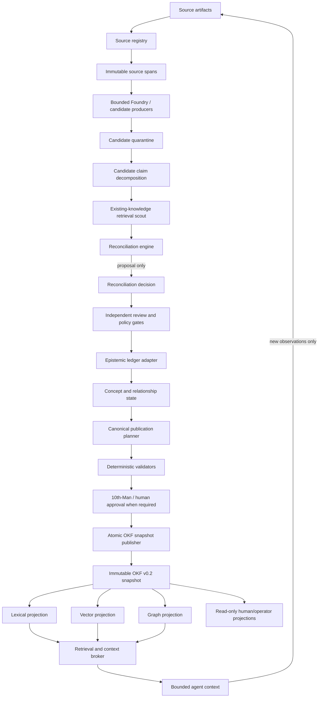

# Erasmus Phase 3 Governed Knowledge System

- **Version:** 1.0.0
- **Status:** Accepted target design; deferred and non-authorizing
- **Scope:** Governed conversion of evidence and candidate concepts into durable claims, concepts, relationships, canonical OKF publications, and rebuildable retrieval projections
- **Dependency:** The bounded PDF-to-OKF candidate Foundry described in [`../okf-knowledge-foundry.md`](../okf-knowledge-foundry.md)
- **Authority:** Subordinate to [`../../DEVELOPMENT_TRACK.md`](../../DEVELOPMENT_TRACK.md), the immutable constitution, mission contracts, capability contracts, the epistemic ledger, and human-approval policy
- **Implementation posture:** Windows-first; existing Python kernel remains authoritative until separately migrated; Rust-first for future performance-critical components; mistral.rs primary; llama.cpp fallback; CUDA preferred with Vulkan/WebGPU fallback; no Docker

## 0. Repository and implementation boundary

This package defines the currently declared target architecture, contracts, lifecycle, reconciliation rules, persistence boundaries, projections, security controls, tests, and staged evolution of the governed knowledge system. Static coverage does not prove the future runtime implementation or exclude defects that executable review later discovers.

Landing this design does **not** activate Phase 3 or authorize an implementation. Every roadmap increment requires a separately bounded mission with exact acceptance criteria, typed contracts, deterministic and negative tests, migration and rollback evidence, independent review, and a 10th-Man countercase.

Until an increment is promoted:

- the current one-process SQLite-backed Erasmus kernel remains authoritative;
- the existing epistemic ledger remains authoritative for proposition truth-state transitions;
- the current sleep pipeline remains a candidate-classification and explicit-decision mechanism;
- the current capability graph remains a separate authority for executable capabilities;
- PR #68's Foundry output remains external `status: draft` candidate material;
- no candidate, model output, OKF document, vector result, graph result, or retrieval score may silently become canonical knowledge or grant execution authority;
- no generic remote graph database, autonomous ontology, or whole-kernel rewrite is authorized.

## 1. Executive definition

Phase 3 is a governed knowledge-evolution control plane. It accepts immutable source evidence and candidate assertions, compares them with existing knowledge, preserves agreement and disagreement, obtains required review, changes epistemic and publication state through append-only decisions, and emits immutable OKF v0.2 publication snapshots.

The system separates seven layers:

1. **Evidence layer** — immutable source artifacts, source spans, deterministic receipts, observations, and human decisions.
2. **Claim layer** — atomic propositions linked to evidence and governed by the existing epistemic ledger.
3. **Concept layer** — durable semantic subjects that organize claims without replacing claim-level provenance.
4. **Inquiry and synthesis layer** — governed open questions, hypotheses, research closure, and derived explanations bound to exact claims and evidence.
5. **Relationship layer** — typed, versioned relationships among concepts, claims, evidence, projects, tools, and temporal states.
6. **Publication layer** — immutable OKF v0.2 snapshots produced deterministically from accepted operational records.
7. **Projection layer** — disposable lexical, vector, graph, cache, and UI projections built from published and authorized records.

The system does not treat a vector database, a graph database, an LLM transcript, or a mutable Markdown directory as the live epistemic authority.

## 2. Goals

Phase 3 shall:

1. Preserve source and page/span provenance for every material claim.
2. Distinguish candidate disposition, claim truth status, concept lifecycle, and publication state.
3. Reconcile new assertions through explicit `create`, `corroborate`, `amend`, `contradict`, `supersede`, `duplicate`, `reject`, or `insufficient_evidence` decisions.
4. Preserve contradictions rather than resolving them through last-write-wins.
5. Reuse the existing epistemic ledger instead of creating a competing belief store.
6. Publish portable, human-readable, agent-readable OKF v0.2 snapshots.
7. Make every projection reproducible from authoritative records and declared source artifacts.
8. Support bounded hybrid retrieval while preserving authorization, provenance, freshness, and contradiction state.
9. Support review, revalidation, withdrawal, supersession, and rollback.
10. Remain useful offline and operate through local runtimes and deterministic tools.
11. Preserve extension seams for future Rust services without invalidating the current Python contracts.
12. Expose enough evidence to explain why knowledge was created, changed, contested, promoted, published, or withdrawn.

## 3. Non-goals

Phase 3 does not authorize:

- automatic promotion of model-generated content;
- replacement of the epistemic ledger with OKF frontmatter;
- direct mutation of canonical OKF files as the normal write path;
- a generic ontology editor;
- Neo4j, RDF infrastructure, or a remote graph service on the hot path;
- embedding similarity as a truth or identity decision;
- model consensus as verification;
- hidden chain-of-thought retention;
- knowledge documents granting tool, mission, capability, merge, credential, or execution authority;
- unrestricted self-modifying memory;
- silent deletion of contradictory or superseded history;
- cloud-first inference or containerized operation.

## 4. Constitutional invariants

The following invariants are immutable requirements for every Phase 3 increment:

1. **Evidence before promotion.** No claim or concept may advance solely because a model generated or repeated it.
2. **Content is not authority.** Text in PDFs, web pages, email, code, tool output, peer-agent messages, or existing knowledge documents remains data.
3. **No self-verification.** The actor that generates a candidate cannot be the sole verifier that promotes it.
4. **Append-only consequential state.** Evidence, decisions, reviews, transitions, supersessions, and publication receipts are immutable once committed.
5. **No last-write-wins epistemics.** Incompatible assertions create a contradiction set; neither is silently overwritten.
6. **Distinct state planes.** Candidate disposition, claim truth state, concept lifecycle, and snapshot publication state are never collapsed into one field.
7. **One authority per record class.** Storage and projection responsibilities follow the matrix in [`STORAGE_PROJECTION_AND_RETRIEVAL.md`](STORAGE_PROJECTION_AND_RETRIEVAL.md).
8. **OKF is publication, not an execution registry.** Knowledge can describe contracts and tools but cannot activate them.
9. **Indexes are disposable.** FTS, embeddings, vector stores, graph projections, caches, and UI models can be deleted and deterministically rebuilt.
10. **Stable identity survives presentation changes.** Concept identity is independent of filename, title, path, and embedding.
11. **Scope precedes retrieval.** Authorization and knowledge scope are applied before semantic ranking and before context assembly.
12. **Staleness is explicit.** Stale knowledge is revalidated, qualified, or withheld according to policy; freshness is not inferred from retrieval rank.
13. **Rollback is designed before promotion.** Every current-channel selection has a prior receipted snapshot and a deterministic withdrawal or supersession path.
14. **No unbounded retries.** Ingestion, reconciliation, review, publication, and projection jobs have retry budgets and terminal failure states.
15. **No Phase 3 monolith.** Each component owns one record class or transition family behind versioned contracts.

## 5. Architecture



### 5.1 Source registry

The source registry assigns immutable content identity, records storage and access scope, and creates source-span identities. It does not interpret source truth.

Responsibilities:

- calculate and verify SHA-256 content digests;
- record source kind, original path/URI, media type, byte size, acquisition time, and access scope;
- retain page, section, line, byte, object, table, or record coordinates as applicable;
- record extraction-tool identity, version, options, and receipt;
- prevent a mutable path or URL from masquerading as immutable evidence;
- detect repeated ingestion of identical bytes;
- support tombstoning or content removal without falsifying the audit trail.

### 5.2 Candidate quarantine

All model-generated, imported, extracted, or externally authored assertions enter quarantine. Quarantine records are inspectable but cannot be retrieved as canonical knowledge by default.

The quarantine layer enforces:

- complete source provenance;
- untrusted-content labeling;
- schema validation;
- size and count budgets;
- injection-resistant prompts and no execution tools;
- explicit candidate identity and idempotency keys;
- rejection of malformed, path-escaping, or self-verifying records.

### 5.3 Candidate claim decomposition

A candidate concept is decomposed into atomic candidate claims. One concept may contain multiple claims with different evidence and truth states. Claims are the unit of support, contradiction, falsification, and supersession.

Examples:

- Concept: `KV Cache Engineering`
- Claim A: KV-cache memory scales with context length for a fixed model architecture.
- Claim B: A particular cache quantization yields a measured saving on a declared model/runtime/hardware combination.
- Claim C: The saving remains acceptable under a declared accuracy test.

Claims B and C require narrower scope and stronger evidence than Claim A. The concept document must not flatten them into one confidence value.

### 5.4 Existing-knowledge retrieval scout

The scout finds plausible comparison targets. It is a recall-oriented proposal mechanism, not a decision-maker.

It may use:

- exact concept resource IDs;
- prior OKF paths and aliases;
- normalized title and identifier matching;
- source and claim digests;
- SQLite FTS5;
- embeddings/vector similarity;
- graph-neighborhood traversal;
- project, domain, temporal, and applicability filters.

The scout returns candidates with reasons and scores. Scores never directly change knowledge state.

### 5.5 Reconciliation engine

The reconciliation engine combines deterministic identity checks, typed scope comparison, existing claim state, source independence, temporal compatibility, and bounded semantic analysis. It proposes one of the decisions defined in [`KNOWLEDGE_LIFECYCLE_AND_RECONCILIATION.md`](KNOWLEDGE_LIFECYCLE_AND_RECONCILIATION.md).

A model may propose semantic equivalence or contradiction, but deterministic policy decides whether the proposal is admissible and which review is required.

### 5.6 Epistemic ledger adapter

The ledger adapter is the only Phase 3 component permitted to create or transition propositions in the existing epistemic ledger. It translates approved knowledge operations into existing ledger evidence, proposition, support, contradiction, falsification, reopen, confidence-history, and supersession operations.

It must not create a parallel truth-state field in the concept store.

### 5.7 Concept and relationship store

The concept store organizes stable subjects and immutable revisions. It references ledger propositions instead of copying their current status as authority.

The relationship store records typed relationships such as:

- `describes`
- `part_of`
- `depends_on`
- `implements`
- `applies_to`
- `contrasts_with`
- `derived_from`
- `supersedes`
- `validated_by`
- `has_claim`
- `has_evidence`
- `conflicts_with`

Relationship types are namespaced and versioned. Unknown relationship types remain readable but cannot affect policy until registered through a separately authorized contract.

### 5.8 Review and adjudication

Review is a first-class immutable record. Reviewers inspect source spans, candidate claims, comparison targets, proposed reconciliation, deterministic checks, unresolved contradictions, and publication impact.

Review classes:

- deterministic validation;
- independent model review;
- domain review;
- security/privacy review;
- 10th-Man adversarial review;
- human approval.

Review requirements are selected by risk, source trust, contradiction state, target lifecycle transition, and policy.

### 5.9 Canonical publication planner

The planner computes a proposed OKF snapshot from accepted operational state. It does not write into the current published directory.

It produces:

- exact included concept revisions;
- exact included claims and claim-state annotations;
- source entries and per-claim footnotes;
- relationship links;
- generated and verified events;
- lifecycle and freshness metadata;
- prior-path aliases;
- a complete snapshot manifest and content digests.

### 5.10 Receipt-first append-only OKF publisher

The publisher follows the intent/artifact/receipt/channel-selection protocol in the storage specification. A `new_snapshot` intent writes and validates two temporary renders, inserts one artifact/membership set with its immutable `snapshot_sequence`, installs one immutable directory on the same filesystem, commits a materialization receipt, and only then replaces the channel pointer. A rollback/reselection intent increments `attempt_sequence`, verifies an existing same-channel snapshot and original materialization receipt, commits a new reselection receipt, and advances `pointer_generation` without rendering, installing, or reinserting the artifact. Filesystem and SQLite operations are ordered and recoverable, never described as one cross-resource atomic transaction.

First publication is an explicit bootstrap: no pointer, no selection event, logical pointer generation 0, and non-serving. The first receipt declares generation 1 before the absent pointer is compare-and-swapped. `attempt_sequence`, immutable `snapshot_sequence`, and `pointer_generation` are separate machine fields and are never inferred from one another.

Published snapshot directories are immutable. Corrections create a new snapshot; they do not edit history in place.

### 5.11 Projection manager

The projection manager consumes an immutable snapshot plus authorized operational metadata and builds:

- SQLite FTS5 indexes;
- embedding/vector indexes;
- graph adjacency/materialized traversal indexes;
- freshness queues;
- read-only API and UI models;
- bounded retrieval caches.

Each projection records source snapshot ID, builder version, model/index identity where applicable, configuration digest, build status, and checksum.

### 5.12 Retrieval and context broker

The broker is the only supported path from knowledge projections into agent context. It selects an authorized channel, validates its exact receipted current pointer and snapshot membership, then applies directives, scope, freshness, contradiction, and evidence constraints before returning a bounded evidence packet. Internal lifecycle is metadata/quality input, never channel authorization.

It returns claims and source references, not an unqualified text blob.

### 5.13 Policy, identity, semantic registry, and publication channels

The knowledge control plane evaluates an exact active `KnowledgePolicySet` and immutable semantic-registry snapshot before consequential admission, reconciliation, promotion, publication, or retrieval. Policy is deterministic, deny-by-default, and external to ordinary knowledge content.

Stable `EntityRecord` identities and append-only alias/identity-resolution decisions prevent titles, paths, aliases, or embedding similarity from becoming identity authority. Registered predicate and relationship definitions control automated semantics; unknown types remain descriptive only.

Publication is selected through governed `PublicationChannel` records. Each private, project, shared, or public channel has its own policy, scope, renderer, immutable snapshots, and current pointer. There is no single global current snapshot that can accidentally broaden audience or scope.

Complete contracts and precedence are defined in [`POLICY_IDENTITY_AND_REGISTRIES.md`](POLICY_IDENTITY_AND_REGISTRIES.md).

### 5.14 Operator service and durable jobs

All headless CLI, Tauri, OpenCode, MCP, and future local-service clients invoke one versioned request/response contract. They do not access SQLite, source storage, projections, or snapshot pointers directly.

Long-running extraction, decomposition, comparison, publication, projection, and revalidation work uses durable `KnowledgeJob` records with bounded leases, checkpoints, cancellation, retry, progress, and terminal receipts. The target commands, exit codes, dry-run behavior, diagnostics, backup, recovery, and PowerShell workflows are defined in [`OPERATOR_API_AND_RUNBOOK.md`](OPERATOR_API_AND_RUNBOOK.md).

### 5.15 Uncertainty, impact, invalidation, and serving controls

Typed uncertainty records distinguish measurement, model, semantic, identity, scope, temporal, evidence-sufficiency, freshness, retrieval, synthesis, and operational uncertainty. They do not collapse into model confidence, source count, or one universal scalar.

Authoritative dependency and `KnowledgeUseReceipt` records support bounded downstream impact analysis when sources, claims, identities, policies, registries, tools, models, snapshots, or projections become unsafe or invalid.

An authorized `ServingDirective` can immediately qualify, exclude, block, or suspend affected content per channel before a corrected immutable snapshot is ready. Directives are applied before content reaches model context or cache; they never rewrite claim truth state or historical snapshots.

Minimum invalidation and append-only directive supersession is a hard prerequisite to the first current publication and retrieval. Full dependency traversal and downstream impact analysis remain staged later.

The complete model is defined in [`UNCERTAINTY_IMPACT_AND_SERVING_CONTROLS.md`](UNCERTAINTY_IMPACT_AND_SERVING_CONTROLS.md).

## 6. Distinct internal and publication state planes

### 6.1 Candidate disposition

Candidate disposition describes whether an incoming candidate is admissible for comparison:

- `quarantined`
- `admissible`
- `duplicate`
- `insufficient_evidence`
- `rejected`

### 6.2 Reconciliation decision

The reconciliation decision describes how an admissible candidate relates to existing knowledge:

- `create`
- `corroborate`
- `amend`
- `contradict`
- `supersede`
- `duplicate`
- `reject`
- `insufficient_evidence`

### 6.3 Claim epistemic state

Claim truth state remains the existing ledger vocabulary:

- `speculative`
- `analogy`
- `leap`
- `unresolved`
- `plausible`
- `supported`
- `established`
- `contradicted`
- `falsified`

Phase 3 may add typed metadata and policy around these states but must not silently reinterpret them.

### 6.4 Internal concept lifecycle

Concept lifecycle describes publication readiness, not truth:

- `provisional`
- `reviewed`
- `validated`
- `contested`
- `superseded`
- `rejected`
- `deprecated`

Publication does not change this lifecycle. A validated concept may be current in one channel, historical in another, and unpublished in a third. A published concept may contain a clearly marked contested claim when channel policy permits it.

### 6.5 Snapshot state

Append-only snapshot events move through:

- `prepared`
- `validated`
- `approved`
- `materialized`
- `failed`

Receipts record terminal publication attempts; channel-selection events record activation, rollback, and reselection. These do not mutate artifact state.

### 6.6 Channel publication state

`unpublished`, `current`, `historical`, and `withdrawn` are derived per `(channel_id, receipted snapshot_id, snapshot membership)`. This relation is not a global concept transition.

## 7. Identity and versioning

### 7.1 Internal stable IDs

Every durable record receives an immutable ID independent of title or path:

```text
urn:erasmus:source:<sha256>
urn:erasmus:span:<source-sha256>:<coordinate-hash>
urn:erasmus:candidate:<uuid>
urn:erasmus:candidate-claim:<uuid>
urn:erasmus:claim:<uuid>
urn:erasmus:entity:<uuid>
urn:erasmus:concept:<uuid>
urn:erasmus:concept-revision:<uuid>
urn:erasmus:relationship:<uuid>
urn:erasmus:open-question:<uuid>
urn:erasmus:synthesis:<uuid>
urn:erasmus:knowledge-policy:<id>
urn:erasmus:semantic-registry-snapshot:<uuid>
urn:erasmus:publication-channel:<id>
urn:erasmus:knowledge-job:<uuid>
urn:erasmus:uncertainty:<uuid>
urn:erasmus:knowledge-dependency:<uuid>
urn:erasmus:knowledge-use:<uuid>
urn:erasmus:invalidation-event:<uuid>
urn:erasmus:knowledge-impact:<uuid>
urn:erasmus:serving-directive:<uuid>
urn:erasmus:review:<uuid>
urn:erasmus:decision:<uuid>
urn:erasmus:snapshot:<uuid>
urn:erasmus:projection:<uuid>
```

UUIDs are generated by the trusted control plane. Content-addressed source and span IDs are deterministic.

### 7.2 OKF identity

OKF defines the concept ID as the bundle-relative path without `.md`. Erasmus additionally writes the stable `urn:erasmus:concept:<uuid>` in `resource` and an `erasmus` extension block.

A rename changes the OKF path but not the resource identity. Prior paths are retained as aliases and redirect concepts for at least one publication cycle when policy permits.

### 7.3 Revisions

A concept revision is immutable and contains:

- concept ID;
- monotonic revision number;
- parent revision ID;
- normalized title and target path;
- selected claim IDs;
- selected relationship IDs;
- rendering policy version;
- content digest;
- generation actor and time;
- lifecycle state at revision creation.

Concurrent writes use an expected-parent revision. A stale expected parent fails with `revision_conflict`; the system never silently rebases consequential knowledge.

### 7.4 Content digests

Canonical JSON serialization is used for record digests. OKF document digests use normalized UTF-8 with LF line endings and no trailing whitespace. Builder and validator versions are included in snapshot receipts, not in the document digest input.

## 8. Authority model

Minimum authorities:

- `knowledge:read`
- `knowledge:ingest`
- `knowledge:quarantine`
- `knowledge:reconcile`
- `knowledge:review`
- `knowledge:promote`
- `knowledge:publish`
- `knowledge:withdraw`
- `knowledge:revalidate`
- `knowledge:reindex`
- `knowledge:admin`

No authority is inherited by implication. Capabilities declare the exact required authorities.

### 8.1 Risk classes

- **Routine:** Low-consequence descriptive knowledge with immutable sources and no protected data.
- **Consequential:** Knowledge that may materially influence engineering, financial, operational, security, or health decisions.
- **Protected:** Credentials, personal data, safety-critical operating instructions, legal constraints, immutable contracts, or control-plane policy.

### 8.2 Minimum promotion rules

- `provisional -> reviewed`: independent reviewer required.
- `reviewed -> validated`: deterministic validators and evidence-sufficiency policy required.
- Validated-revision publication, routine: may be automated only when policy explicitly allows it, all sources are available, no unresolved contradiction exists, and generation/review actors are independent.
- Validated-revision publication, consequential: human approval and 10th-Man review required.
- Any protected-state publication: explicit human approval, security/privacy review, and dual-control policy required.
- Supersession, withdrawal, or deprecation: evidence, impact analysis, replacement or withdrawal reason, and per-channel publication rollback point required.

## 9. OKF v0.2 publication profile

Every Erasmus-published concept uses conformant OKF v0.2 frontmatter and an `erasmus` extension block. Example:

```yaml
---
type: Engineering Concept
title: KV Cache Engineering
description: Memory and performance principles for transformer inference caches.
resource: urn:erasmus:concept:5f89e92b-8c2a-4ed6-8138-816ac0bf4ae6
tags: [inference, kv-cache]
sources:
  - id: src-a
    resource: references/sha256/ab/cd/abcdef.pdf
    title: Source paper
    author: team:source-authors
    last_modified: 2026-07-01
generated:
  by: process:erasmus-okf-publisher/1.0.0
  at: 2026-08-09T23:30:00Z
verified:
  - by: process:erasmus-knowledge-validator/1.0.0
    at: 2026-08-09T23:31:00Z
status: canonical
stale_after: 2027-02-09
erasmus:
  profile: erasmus.knowledge-concept/v1
  revision: 7
  revision_id: urn:erasmus:concept-revision:...
  channel_id: urn:erasmus:publication-channel:private-default
  snapshot_id: urn:erasmus:snapshot:...
  claim_ids:
    - urn:erasmus:claim:...
  lifecycle: validated
  channel_publication_state: current
  risk_class: routine
  prior_paths: []
---
```

Rules:

- `generated` identifies the deterministic publication process, not the original candidate model.
- Candidate-model provenance remains on claims and source decisions.
- `verified` contains only completed independent verification events.
- A stored credibility score is prohibited; source signals and review events remain objective inputs.
- Per-claim attribution uses OKF source IDs and Markdown footnotes.
- Unknown OKF fields are preserved during round-trip import.
- Imported human-authored OKF changes become candidates; they do not mutate the current snapshot directly.

## 10. Canonical concept rendering

A concept document is a deterministic view over a specific concept revision. Recommended body structure:

```markdown
# Summary

# Current claims

# Contested or conditional claims

# Applicability and exclusions

# Relationships

# Verification and tests

# Supersession history

# References
```

The renderer shall:

- order claims deterministically;
- include claim IDs in machine-readable anchors or extension metadata;
- show claim epistemic state and applicability where material;
- retain contradiction links;
- omit rejected candidates from the canonical body while retaining them in audit records;
- avoid silently synthesizing a stronger claim than the ledger supports;
- preserve source-footnote joins;
- produce byte-identical output for identical input records and renderer version.

## 11. Knowledge mutation protocol

Every consequential mutation is a command with:

- command ID and idempotency key;
- expected current revision or snapshot;
- actor and exact authority;
- mission ID;
- operation;
- target IDs;
- evidence IDs;
- rationale summary;
- required reviews;
- policy version;
- rollback reference;
- requested timestamp.

The control plane validates and commits the command in one SQLite transaction. Projection work is emitted through a durable outbox and can be retried independently.

No model writes database rows or files directly.

## 12. Failure handling and recovery

### 12.1 Fail-closed conditions

The system fails closed when:

- source bytes or declared digest do not match;
- required spans cannot be reproduced;
- candidate response violates schema or budget;
- comparison targets are ambiguous beyond policy limits;
- a required source is inaccessible;
- a revision precondition is stale;
- review independence is violated;
- required deterministic validation fails;
- contradiction policy is unresolved;
- canonical rendering is non-deterministic;
- links escape the bundle or are broken;
- publication manifest hashes do not match;
- an authority or mission boundary is missing;
- a projection claims a different source snapshot.

### 12.2 Crash recovery

- Ingestion runs and reconciliation jobs are resumable by idempotency key.
- Consequential database transitions commit atomically.
- Publication writes into a new temporary directory and never edits the active snapshot.
- The `current` pointer changes only after its exact success receipt is durably committed; an unreceipted pointer is invalid and non-serving.
- Snapshot, receipt, selection, and evidence-packet receipt state is append-only and ordered by global `event_seq`; timestamps never decide recovery.
- Bootstrap recovery never requires or restores a nonexistent prior receipt: before generation 1 it remains non-serving, resumes/fails the first intent, activates only while absence/generation 0 still matches, or confirms an already receipted generation-1 pointer.
- Later recovery deterministically resumes or records failure, completes a safe receipt-first pointer change, confirms an already safe pointer, or reconstructs the last confirmed receipted pointer.
- Projection jobs restart from the last committed snapshot/projection checkpoint.

### 12.3 Rollback

Publication rollback creates a `reselect_existing` intent and new reselection receipt targeting a previously materialized same-channel snapshot, advances `attempt_sequence` and `pointer_generation`, and appends a rollback channel-selection event. It retains the target's original `snapshot_sequence`; it does not insert snapshot/member rows, render/install a directory, or delete/mutate either snapshot.

Operational rollback uses compensating transitions, supersession, or withdrawal records; append-only history remains intact.

## 13. Security and privacy summary

Detailed requirements are in [`SECURITY_PRIVACY_AND_GOVERNANCE.md`](SECURITY_PRIVACY_AND_GOVERNANCE.md). Minimum controls include:

- untrusted parser isolation and resource limits;
- no source-originated instructions or tools;
- path normalization and root confinement;
- decompression/page/object limits;
- secret scanning before publication;
- authorization-aware retrieval;
- source and concept scopes;
- provenance-preserving redaction;
- poisoning and prompt-injection tests;
- deterministic output sanitization;
- no credentials in OKF or indexes;
- model/runtime identity recorded for every semantic proposal.

## 14. Retrieval contract summary

A retrieval response is an evidence packet, not prose. It contains:

- query and normalized constraints;
- channel and snapshot IDs plus immutable `snapshot_sequence`;
- exact publication receipt and selected `pointer_generation`;
- directive-set digest, `as_known_event_seq`, and packet `event_seq`;
- claim ID;
- concept ID and path;
- selected text;
- claim epistemic status;
- concept lifecycle;
- contradiction flags;
- freshness state;
- source references;
- lexical/vector/graph retrieval features;
- reranking result;
- authorization scope;
- truncation and omitted-item counts.

The context broker explicitly labels the packet as reference evidence. The model receives no implicit authority from ranking.

## 15. Observability

Every run records:

- mission, actor, authority, policy, and component versions;
- source, candidate, claim, concept, revision, decision, review, snapshot, and projection IDs;
- deterministic checks and receipts;
- model/runtime identity for semantic operations;
- comparison targets and reconciliation proposal;
- selected decision and rejected alternatives;
- contradiction and risk classification;
- retry, failure, recovery, and rollback events;
- publication and projection durations;
- retrieval quality and evidence coverage metrics;
- human intervention and approval events.

Raw hidden reasoning is not stored. Structured rationale, alternatives, evidence, and decision codes are stored.

## 16. Implementation boundaries

The first implementation remains in the existing Python/SQLite kernel unless a narrower mission proves a native component is required. The design preserves Rust migration seams through language-neutral JSON contracts, immutable IDs, canonical serialization, and deterministic receipts.

Potential future Rust crates, when separately authorized:

```text
crates/
├── erasmus-knowledge-contracts/
├── erasmus-source-registry/
├── erasmus-reconciliation/
├── erasmus-okf-publisher/
├── erasmus-knowledge-projections/
└── erasmus-context-broker/
```

No Tauri surface is authorized until backend contracts, migrations, and headless commands are stable. Tauri remains a read/control surface rather than knowledge authority.

## 17. Design-package coverage

This documentation package covers the declared Phase 3 contract surfaces when the repository contains and cross-links:

1. This architecture specification.
2. [`CONTRACT_CATALOGUE.md`](CONTRACT_CATALOGUE.md).
3. [`STATE_MODEL.md`](STATE_MODEL.md).
4. [`KNOWLEDGE_LIFECYCLE_AND_RECONCILIATION.md`](KNOWLEDGE_LIFECYCLE_AND_RECONCILIATION.md).
5. [`OPEN_QUESTIONS_AND_SYNTHESIS.md`](OPEN_QUESTIONS_AND_SYNTHESIS.md).
6. [`POLICY_IDENTITY_AND_REGISTRIES.md`](POLICY_IDENTITY_AND_REGISTRIES.md).
7. [`STORAGE_PROJECTION_AND_RETRIEVAL.md`](STORAGE_PROJECTION_AND_RETRIEVAL.md).
8. [`UNCERTAINTY_IMPACT_AND_SERVING_CONTROLS.md`](UNCERTAINTY_IMPACT_AND_SERVING_CONTROLS.md).
9. [`OPERATOR_API_AND_RUNBOOK.md`](OPERATOR_API_AND_RUNBOOK.md).
10. [`SECURITY_PRIVACY_AND_GOVERNANCE.md`](SECURITY_PRIVACY_AND_GOVERNANCE.md).
11. [`TEST_AND_ACCEPTANCE_PLAN.md`](TEST_AND_ACCEPTANCE_PLAN.md).
12. [`GLOSSARY.md`](GLOSSARY.md).
13. [`DESIGN_TRACEABILITY_MATRIX.md`](DESIGN_TRACEABILITY_MATRIX.md).
14. [`../../roadmap/ERASMUS_IMPLEMENTATION_ROADMAP.md#track-b-knowledge-system-evolution`](../../roadmap/ERASMUS_IMPLEMENTATION_ROADMAP.md#track-b-knowledge-system-evolution).
15. [`../../adr/ADR-KNOWLEDGE-001-authoritative-state-and-okf-publication.md`](../../adr/ADR-KNOWLEDGE-001-authoritative-state-and-okf-publication.md).
16. Experimental, non-runtime schema seeds under [`schemas/`](schemas/).

This is static design/schema coverage only. It does not prove runtime crash safety, concurrency, recovery, filesystem durability, migration correctness, serving enforcement, or cross-platform behavior; each implementing mission must supply that executable evidence.

## 18. 10th-Man countercase

The strongest countercase is that this design creates an elegant but oversized knowledge platform before the current guarded mission loop and bounded Foundry have demonstrated repeated operational value.

The answer is not to implement the package wholesale. The design therefore fixes interfaces and sequencing while making every implementation increment independently optional, observation-first, reversible, and mission-gated. If a proposed increment cannot identify a concrete failure in the existing system, prove a narrow benefit, preserve current authority, and define deterministic rollback, it must remain deferred.
