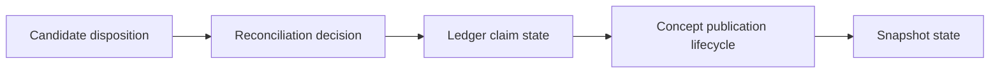
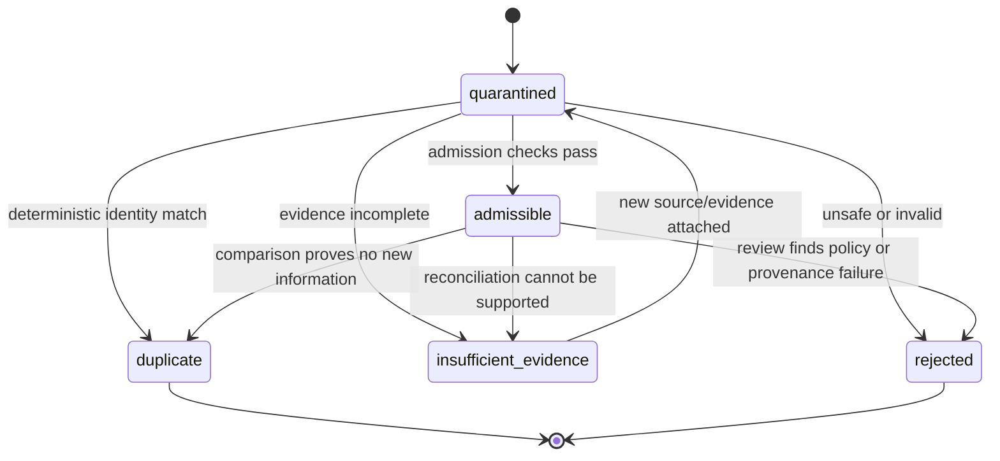

# Phase 3 Knowledge Lifecycle and Reconciliation

- **Version:** 1.0.0
- **Status:** Accepted target design; non-runtime
- **Purpose:** Define exact state planes, legal transitions, reconciliation actions, evidence requirements, contradiction handling, promotion gates, supersession, and rollback

## 1. Why multiple state planes are required

A single `status` field cannot safely represent all of the following:

- whether an incoming record is safe and complete enough to inspect;
- whether it is new, corroborating, contradictory, superseding, or duplicate;
- how strongly an underlying proposition is supported;
- whether a concept has been reviewed and is ready for publication;
- whether a particular publication snapshot is current.

Phase 3 therefore uses four independent state machines. A transition in one plane does not imply a transition in another.



## 2. Candidate disposition state machine

### 2.1 States

| State | Meaning |
|---|---|
| `quarantined` | Candidate is stored but has not passed admission checks. |
| `admissible` | Candidate is structurally valid, provenance-bearing, in scope, and ready for comparison. |
| `duplicate` | Candidate is byte/claim equivalent to an already processed candidate or canonical claim and adds no independent evidence. |
| `insufficient_evidence` | Candidate is intelligible but lacks reproducible supporting evidence or required context. |
| `rejected` | Candidate is malformed, unsafe, out of scope, fabricated, policy-prohibited, or permanently inadmissible. |

### 2.2 Legal transitions



`duplicate` and `rejected` are terminal for that candidate record. New evidence creates a new candidate or a new candidate revision; it does not mutate terminal history.

### 2.3 Admission checks

A candidate becomes `admissible` only when all applicable checks pass:

1. Candidate schema validates.
2. Producer identity and runtime/tool identity are recorded.
3. Source IDs and source spans exist and are in scope.
4. Source digests and span text digests verify.
5. Candidate contains no `verified` claim created by its own producer.
6. Candidate size, claim count, and source-count budgets are satisfied.
7. Paths and links remain within allowed roots.
8. Text is classified as untrusted evidence.
9. Secret/privacy scan passes or applies a protected scope.
10. Candidate claims are atomic enough for comparison.
11. Required units, temporal scope, environment, and applicability qualifiers are present.
12. Idempotency and exact duplicate checks complete.

Failure codes are preserved; a generic `invalid` state is prohibited.

## 3. Reconciliation action model

Reconciliation describes how one admissible candidate claim relates to existing claims and concepts. It is an immutable decision, not a mutable state.

### 3.1 Actions

| Action | Required semantic condition | Effect |
|---|---|---|
| `create` | No equivalent or conflicting governed claim exists in compatible scope. | Create a new proposition or bind a new claim to a new proposition; create or attach to a concept. |
| `corroborate` | Candidate is materially equivalent to an existing claim and provides independent evidence. | Add evidence/support to the existing proposition; no duplicate proposition. |
| `amend` | Candidate refines, narrows, qualifies, or extends a claim without making the existing statement false. | Create a new claim/revision and preserve the prior claim; may supersede presentation, not necessarily truth. |
| `contradict` | Candidate and target cannot both be true under compatible subject, scope, time, environment, and qualifiers. | Add contradiction evidence/link; create or update a contradiction set; concept may become `contested`. |
| `supersede` | Candidate explicitly replaces an older claim due to changed time, version, specification, or corrected evidence. | Create replacement proposition/revision and append supersession link. |
| `duplicate` | Candidate is equivalent and adds no independent source, qualifier, applicability, or evidence. | Record no-op decision; retain audit only. |
| `reject` | Candidate is false by deterministic evidence, unsafe, out of scope, fabricated, or policy-prohibited. | Preserve rejection reason; do not create canonical claim. |
| `insufficient_evidence` | Relation cannot be established within evidence and budget constraints. | Preserve candidate for later review; no canonical mutation. |

### 3.2 Decision precedence

The reconciliation engine evaluates in this order:

1. **Safety and scope rejection.** Reject before semantic comparison if policy forbids admission.
2. **Deterministic exact duplicate.** Match source/claim digest and qualifiers.
3. **Stable identity.** Resolve explicit concept, claim, resource, version, and alias IDs.
4. **Scope and applicability compatibility.** Incompatible scope prevents duplicate/corroborate/contradict decisions.
5. **Temporal/version relation.** Determine whether differences indicate supersession rather than contradiction.
6. **Evidence independence.** Equivalent claims with the same evidence lineage are duplicates; independent evidence may corroborate.
7. **Logical compatibility.** Determine amend versus contradict.
8. **Novelty.** Create only after plausible existing targets are exhausted within declared recall budgets.
9. **Evidence sufficiency.** Select insufficient evidence rather than guessing.

### 3.3 Deterministic decision table

| Existing target | Candidate relation | Independent evidence? | Compatible qualifiers? | Required action |
|---|---|---:|---:|---|
| Exact same claim digest | Same | No | Yes | `duplicate` |
| Equivalent claim | Same | Yes | Yes | `corroborate` |
| Broader existing claim | Candidate narrows applicability | Any | Yes | `amend` |
| Narrower existing claim | Candidate generalizes beyond evidence | No | No/unknown | `insufficient_evidence` |
| Same subject/predicate | Different object | Any | Same time/scope | `contradict` unless one is deterministically falsified |
| Same subject/predicate | New object | Any | Later declared version/time | `supersede` when replacement semantics are explicit |
| Related concept only | New atomic proposition | Yes | Yes | `create` and attach to concept |
| No plausible target | New proposition | Yes | Yes | `create` |
| No plausible target | New proposition | No | Unknown | `insufficient_evidence` |
| Any | Malicious/out-of-scope/fabricated | Any | Any | `reject` |

### 3.4 Model role

A model may:

- decompose text into candidate claims;
- propose comparison targets;
- propose equivalence, refinement, contradiction, or supersession;
- summarize evidence and unresolved distinctions;
- draft concept wording.

A model may not:

- select final reconciliation action without policy evaluation;
- assert evidence independence;
- grant authority;
- write ledger transitions;
- mark its own output verified;
- decide that conflicting claims are resolved merely because one is more fluent;
- publish a snapshot.

## 4. Scope, time, and applicability comparison

Two claims are eligible for equivalence or contradiction only after deterministic qualifier comparison.

### 4.1 Scope dimensions

- visibility/tenant;
- project;
- domain;
- subject identity;
- jurisdiction or standard;
- hardware/environment;
- software/model/runtime version;
- geometry, units, coordinate frame, and material system where applicable;
- effective-time interval;
- operating-condition envelope;
- population/sample definition;
- confidence/uncertainty representation.

### 4.2 Compatibility outcomes

- `equal`
- `candidate_subset`
- `target_subset`
- `overlap`
- `disjoint`
- `unknown`

Only `equal` supports straightforward duplicate/corroborate decisions. `candidate_subset` or `target_subset` normally implies amendment or separate conditional claims. `disjoint` claims are not contradictory. `unknown` normally results in `insufficient_evidence`.

## 5. Evidence independence

Corroboration requires evidence that is not merely a copy, summary, citation echo, shared upstream source, model repetition, or agreement among agents using the same evidence.

### 5.1 Evidence lineage classes

- **same artifact** — identical source digest;
- **derived copy** — different artifact but declared or detected derivation from the same source;
- **shared upstream** — separate documents relying on the same underlying data or authority;
- **independent observation** — separate acquisition or measurement path;
- **independent deterministic test** — separately executed test with declared environment and receipt;
- **independent primary source** — separate primary authority or dataset.

Only the final three may increase corroboration strength by policy. A model cannot establish independence by statement alone.

## 6. Existing ledger integration

The existing Erasmus ledger remains authoritative for claim truth state.

### 6.1 Creation

`create` results in:

1. admit one or more source spans as `epistemic_evidence` records;
2. create a proposition using an allowed initial state;
3. bind the Phase 3 claim ID to the proposition ID;
4. link the proposition to a concept revision;
5. record the reconciliation decision and audit event.

### 6.2 Corroboration

`corroborate` results in:

1. admit new independent evidence;
2. link evidence to the existing proposition;
3. invoke the existing `support` transition only when its exact next-state and trust requirements pass;
4. record confidence history separately when policy permits;
5. create a new concept revision only if published wording or source attribution changes.

Repetition or agreement remains prohibited promotion evidence, consistent with the current ledger.

### 6.3 Contradiction

`contradict` results in:

1. admit contradiction or tangible-wrongness evidence;
2. invoke the existing contradiction/falsification operation when its requirements pass;
3. create a contradiction set linking all incompatible claims;
4. move affected concept lifecycle to `contested` when the contradiction is material to the concept's current summary;
5. preserve both claims and all prior publications.

### 6.4 Supersession

`supersede` results in:

1. create or identify a replacement proposition;
2. admit supersession evidence;
3. invoke existing proposition supersession;
4. create a new concept revision selecting the replacement claim;
5. retain the old claim in supersession history;
6. publish a new snapshot only after normal gates.

### 6.5 Falsification and reopen

Phase 3 does not redefine existing falsification rules. A falsified claim can re-enter only through the existing `reopen` operation with genuinely new evidence. A new candidate does not automatically reopen a falsified path.

## 7. Contradiction sets

A contradiction set is a durable object containing claims that cannot all be true under compatible qualifiers.

Required fields:

- contradiction-set ID;
- member claim IDs;
- shared subject/predicate/scope;
- incompatibility type;
- evidence IDs;
- review IDs;
- status: `open`, `partially_resolved`, `resolved`, `superseded`;
- resolution decision and time where applicable.

### 7.1 Rules

- Contradiction membership is append-only; removal occurs through a resolution record, not deletion.
- Ranking cannot resolve a contradiction.
- Canonical publication may include an open contradiction when the disagreement itself is established knowledge.
- Retrieval packets must expose contested state and all materially relevant sides within budget.
- A contradiction is resolved only by deterministic evidence, a governed epistemic transition, explicit scope separation, or authorized adjudication.
- “Most sources agree” is not sufficient without independence and credibility analysis.

## 8. Concept publication lifecycle

### 8.1 States

| State | Meaning |
|---|---|
| `provisional` | Concept/revision is assembled from governed records but not independently reviewed. |
| `reviewed` | Required review has completed; deterministic validation may remain. |
| `validated` | Required deterministic, evidence, and policy gates pass. |
| `contested` | One or more material current claims have unresolved contradictions. |
| `canonical` | Revision is included in the current published OKF snapshot for its scope. |
| `superseded` | A later concept/revision replaces this concept's role. |
| `rejected` | Concept is not admissible for publication. |
| `deprecated` | Concept remains valid for history or compatibility but should not be used for new work. |

### 8.2 Legal transitions

```mermaid
stateDiagram-v2
    [*] --> provisional
    provisional --> reviewed: independent review passes
    provisional --> rejected: review/policy failure
    reviewed --> validated: evidence and deterministic gates pass
    reviewed --> contested: material contradiction found
    reviewed --> rejected: unsupported or unsafe
    validated --> canonical: publication approval and snapshot commit
    validated --> contested: new contradiction before publication
    contested --> reviewed: contradiction scoped or resolved
    contested --> validated: resolution gates pass
    contested --> rejected: concept premise invalidated
    canonical --> contested: new material contradiction
    canonical --> superseded: replacement published
    canonical --> deprecated: retained but discouraged
    canonical --> rejected: prohibited; requires withdrawal record
    deprecated --> superseded: replacement published
    superseded --> [*]
    rejected --> [*]
```



A lifecycle state is recorded through append-only transitions. A mutable `current_state` column may exist only as a rebuildable projection.

## 9. Promotion gates

### 9.1 `provisional -> reviewed`

Required:

- candidate and claim contracts valid;
- producer/reviewer independence;
- all cited source spans reproducible;
- source scope compatible;
- reconciliation decision recorded;
- no unresolved schema or path error;
- reviewer verdict `pass` or `pass_with_conditions` with conditions satisfied.

### 9.2 `reviewed -> validated`

Required:

- evidence sufficiency policy passes per claim;
- existing ledger transitions succeed;
- deterministic link, source, digest, and relationship validators pass;
- risk classification complete;
- security/privacy scan passes;
- open contradiction behavior is explicit;
- rendering input is complete;
- 10th-Man review completed when triggered.

### 9.3 `validated -> canonical`

Required:

- publication plan references exact validated revisions;
- publication policy permits automation for the risk class;
- human approval exists for consequential/protected knowledge;
- no required review is stale relative to the revision digest;
- deterministic rendering produces expected digests;
- full OKF validation and link validation pass;
- secret/privacy scan passes;
- snapshot manifest and rollback target exist;
- atomic publication receipt succeeds.

### 9.4 `canonical -> contested`

Triggered by:

- admitted material contradiction;
- source withdrawal or corruption affecting a material claim;
- failed revalidation;
- newly discovered scope incompatibility;
- deterministic test invalidating a published statement.

The prior snapshot remains immutable. Policy decides whether `current` continues to expose it with a contested banner or switches to a withdrawal snapshot.

### 9.5 `canonical -> superseded`

Required:

- replacement concept/revision is validated;
- supersession relation and evidence exist;
- affected inbound links are evaluated;
- aliases/redirects are planned;
- new snapshot publishes successfully;
- old concept remains accessible by historical snapshot and stable resource ID.

## 10. Review independence

A review is independent only when policy can establish that the reviewer did not merely repeat the same generation path.

Minimum independence dimensions:

- different actor identity;
- different role;
- separate model session or deterministic process;
- no shared hidden mutable state;
- exact reviewed input digest recorded;
- reviewer has not authored the candidate revision being approved;
- required source access exists;
- for high-risk claims, different model/provider alone is insufficient without evidence review.

## 11. Risk-based review matrix

| Transition/action | Routine | Consequential | Protected |
|---|---|---|---|
| Candidate admission | deterministic checks | deterministic + security checks | deterministic + security/privacy review |
| `create`/`corroborate` | independent review | independent + domain review | human + domain + security review |
| `contradict` | independent review | 10th-Man + domain/human as policy | human dual control + 10th-Man |
| `supersede` | independent review | human approval + impact analysis | human dual control + rollback rehearsal |
| `validated -> canonical` | policy-allowed automation or human | human + 10th-Man | human dual control |
| Withdrawal | policy or human | human | human dual control |

## 12. Reconciliation pseudocode

```text
function reconcile(candidate_claim, authorized_scope, policy):
    require candidate_claim.disposition == admissible
    require scope_allows(authorized_scope, candidate_claim.scope)

    exact = find_by_claim_digest(candidate_claim)
    if exact exists:
        if has_independent_new_evidence(candidate_claim, exact):
            return proposal(corroborate, exact)
        return proposal(duplicate, exact)

    targets = retrieve_comparison_targets(candidate_claim, policy.recall_budget)
    targets = filter_scope_time_applicability(targets, candidate_claim)

    if targets is empty:
        if evidence_sufficient_for_new_claim(candidate_claim, policy):
            return proposal(create)
        return proposal(insufficient_evidence)

    for target in deterministic_identity_order(targets):
        relation = compare_qualifiers_and_semantics(candidate_claim, target)

        if relation == equivalent:
            if has_independent_new_evidence(candidate_claim, target):
                return proposal(corroborate, target)
            return proposal(duplicate, target)

        if relation == refinement:
            return proposal(amend, target)

        if relation == explicit_later_replacement:
            return proposal(supersede, target)

        if relation == logically_incompatible:
            return proposal(contradict, target)

    if evidence_sufficient_for_new_claim(candidate_claim, policy):
        return proposal(create)
    return proposal(insufficient_evidence)
```

This procedure produces a proposal. Final decisions require policy, authority, and review.

## 13. Idempotency and concurrent decisions

- Candidate admission uses source/candidate content digests and an ingestion idempotency key.
- Reconciliation commands use an idempotency key and expected target revisions.
- Two decisions affecting the same claim or concept revision serialize through an immediate transaction or equivalent lock.
- The second command fails with `revision_conflict` when its expected state is stale.
- Retrying the same command ID with identical content returns the original result.
- Retrying the same idempotency key with different content fails with `idempotency_conflict`.

## 14. Human edits and imports

A human may edit an exported OKF document, but the live system never treats filesystem mutation as an authoritative state change.

Import process:

1. hash and register the changed document as a new source artifact;
2. diff it against the published snapshot;
3. create candidate concept and candidate claim changes;
4. reconcile each claim;
5. require normal review and promotion;
6. publish a new snapshot if approved.

This preserves human authorship without bypassing evidence and audit controls.

## 15. Deletion, withdrawal, and correction

### 15.1 Rejection

Rejection means “not admitted to canonical knowledge.” It does not delete the candidate or evidence audit record unless retention policy separately requires content removal.

### 15.2 Withdrawal

Withdrawal removes a snapshot or concept from the current published view while preserving immutable historical receipts and non-sensitive metadata.

### 15.3 Redaction

Protected content may be replaced with a redacted source/span revision. The audit retains digests, reason, actor, authority, and affected IDs. Retrieval and publication projections are rebuilt from the redacted snapshot.

### 15.4 Supersession

Supersession is preferred over destructive editing for corrected or evolved knowledge.

## 16. Freshness and revalidation transitions

Freshness is orthogonal to truth and publication lifecycle.

```text
current -> approaching_stale -> stale
current/approaching_stale/stale -> unknown
any -> source_unavailable
stale/unknown/source_unavailable -> current only after revalidation
```

A stale concept is not automatically false. Policy may:

- retrieve it with a stale warning;
- exclude it from consequential contexts;
- create a revalidation mission;
- mark the concept contested when staleness affects a material claim;
- withdraw it when protected policy requires current verification.

## 17. Stop conditions

Reconciliation must stop and return a bounded unresolved result when:

- comparison targets exceed budget;
- required source bytes cannot be obtained;
- qualifiers remain ambiguous;
- evidence independence cannot be established;
- deterministic checks disagree;
- reviewer independence fails;
- policy lacks a rule for the encountered relationship;
- the candidate would require scope expansion;
- a consequential contradiction lacks authorized adjudication;
- retries are exhausted.

The result is `insufficient_evidence` or a typed failure, never fabricated certainty.

## 18. Lifecycle acceptance tests

A promoted implementation must prove:

1. Every illegal transition fails closed.
2. Every legal transition requires the declared evidence and authority.
3. Candidate, claim, concept, and snapshot states cannot be confused by the API.
4. Exact duplicates never create duplicate propositions.
5. Independent corroboration adds evidence without duplicating claims.
6. Contradictions preserve both sides and surface in retrieval.
7. Supersession is acyclic and preserves history.
8. Stale commands fail revision preconditions.
9. Idempotent retries create no duplicate records.
10. Model output alone cannot advance any lifecycle state.
11. Consequential canonical promotion cannot pass without human and 10th-Man records.
12. Rollback returns the published pointer to a prior immutable snapshot without deleting evidence.
