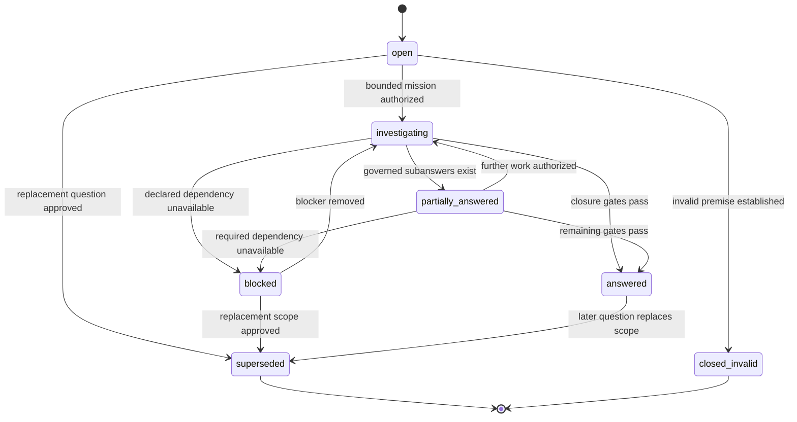

# Phase 3 Open Questions and Governed Synthesis

- **Version:** 1.0.0
- **Status:** Accepted target design; non-runtime
- **Purpose:** Define how Erasmus represents evidence gaps, hypotheses, unresolved questions, research work, and derived synthesis without turning summaries into unsupported truth

## 1. Core rule

Open questions and synthesis are first-class knowledge records, but neither replaces atomic claims or evidence.

- An **open question** records a bounded information need and the evidence required to close it.
- A **synthesis** organizes exact claims, contradictions, relationships, and sources into a useful derived explanation.
- A synthesis may select and explain claims; it may not silently create stronger claims than its inputs support.
- An answer to an open question is not closure until the answer's claims pass normal reconciliation and review.

## 2. Open-question contract

### 2.1 Required fields

```json
{
  "question_id": "urn:erasmus:open-question:<uuid>",
  "question": "What specific uncertainty must be resolved?",
  "scope": {},
  "risk_class": "routine | consequential | protected",
  "status": "open",
  "related_concept_ids": [],
  "related_claim_ids": [],
  "contradiction_set_ids": [],
  "hypothesis_claim_ids": [],
  "required_evidence": [],
  "required_tests": [],
  "exclusions": [],
  "created_by": "Actor",
  "created_at": "ISO-8601",
  "target_date": null,
  "mission_id": null
}
```

### 2.2 States

- `open` — defined and awaiting investigation;
- `investigating` — attached to an authorized mission;
- `partially_answered` — some subquestions have governed answers but closure criteria are incomplete;
- `answered` — closure criteria pass and answer claim IDs are recorded;
- `blocked` — required source, authority, capability, or test is unavailable;
- `superseded` — replaced by a better-scoped question;
- `closed_invalid` — question premise or scope was shown invalid.

### 2.3 State machine



### 2.4 Closure criteria

A question becomes `answered` only when:

1. answer claim IDs exist in the epistemic ledger;
2. claims have the minimum policy-required epistemic state;
3. required source types and deterministic tests are present;
4. material contradictions are resolved or explicitly included in the answer;
5. applicability and exclusions are documented;
6. required domain, security, 10th-Man, or human reviews pass;
7. the closure decision records exact evidence and policy version.

Model-generated prose is never itself an answer record.

## 3. Question decomposition

A broad question may be decomposed into child questions. The parent records:

- child question IDs;
- decomposition actor and method;
- coverage rationale;
- unresolved remainder;
- dependency order;
- stop conditions.

Parent closure requires all mandatory children to close or an explicit evidence-backed decision that a child is non-material.

Question decomposition must not become an unbounded research tree. Maximum depth, child count, time, cost, and retrieval budgets are declared by mission policy.

## 4. Hypotheses

A hypothesis is represented as an ordinary ledger proposition with an initial state such as `speculative`, `analogy`, `leap`, or `unresolved`. The open-question record links to the proposition ID/claim ID.

This avoids a competing hypothesis truth store.

Each hypothesis link records:

- expected explanatory value;
- falsification test IDs or required test descriptions;
- expected observations if true;
- expected observations if false;
- applicability;
- priority/information gain as a routing projection, not truth;
- status read from the ledger.

## 5. Research mission generation

An open question may propose a mission but cannot authorize one.

A mission candidate includes:

- exact question ID;
- objective and closure criteria;
- allowed/prohibited source classes;
- required deterministic tests;
- source and privacy scope;
- capability/tool requirements;
- budget, retry, timeout, and stop conditions;
- rollback for side effects;
- required reviews;
- 10th-Man countercase.

The existing mission authority decides whether it runs.

## 6. Synthesis contract

### 6.1 Purpose

A synthesis is an immutable derived artifact explaining or organizing governed records. It can serve as:

- concept summary;
- state-of-evidence review;
- contradiction summary;
- decision brief;
- technical background;
- problem-resolution summary;
- cross-concept comparison;
- lessons-learned narrative.

### 6.2 Required fields

```json
{
  "synthesis_id": "urn:erasmus:synthesis:<uuid>",
  "synthesis_type": "concept_summary",
  "title": "...",
  "scope": {},
  "risk_class": "routine",
  "input_claim_ids": [],
  "input_concept_revision_ids": [],
  "input_contradiction_set_ids": [],
  "input_source_span_ids": [],
  "input_snapshot_id": "urn:erasmus:snapshot:<uuid>",
  "content": "Markdown or structured content",
  "omitted_material": [],
  "producer": "Actor",
  "producer_profile": "...",
  "content_digest": {},
  "status": "provisional",
  "created_at": "ISO-8601"
}
```

### 6.3 Synthesis states

- `provisional` — produced but not independently checked;
- `reviewed` — exact input and output digests independently reviewed;
- `validated` — grounding, contradiction, coverage, scope, and policy checks pass;
- `contested` — synthesis framing or selection is materially disputed;
- `canonical` — included in the current OKF snapshot as part of a concept revision;
- `superseded` — replaced by a later synthesis;
- `rejected` — unsupported, misleading, unsafe, or out of scope.

The synthesis lifecycle aligns with concept publication lifecycle but remains a distinct record because multiple syntheses may exist for one claim set.

## 7. Synthesis invariants

1. Every material declarative sentence maps to one or more input claim IDs or is explicitly labeled interpretation/question.
2. A synthesis cannot upgrade claim epistemic status.
3. A synthesis cannot omit the contested state of a material input claim.
4. A synthesis cannot broaden scope or applicability beyond its inputs without creating a new candidate claim.
5. Source and claim IDs survive rendering and truncation.
6. Producer and sole verifier are independent.
7. Input snapshot/revision IDs are fixed.
8. A change to any material input invalidates prior validation for current publication.
9. `canonical` synthesis content is rendered deterministically from an approved synthesis record.
10. A synthesis cannot grant mission, capability, tool, skill, policy, or publication authority.

## 8. Grounding and coverage validation

### 8.1 Grounding

For each material statement, validators check:

- referenced claim exists;
- claim statement or a logically narrower paraphrase supports the sentence;
- qualifiers are preserved;
- source spans remain available;
- current ledger status is represented correctly;
- superseded/falsified claims are not presented as current;
- contested state is visible.

A model may propose statement-to-claim mappings. Deterministic IDs and policy validate the mapping structure; independent review evaluates semantic faithfulness.

### 8.2 Coverage

A synthesis records omitted material, including:

- opposing claims;
- lower-confidence claims;
- stale/source-unavailable inputs;
- excluded scopes;
- evidence omitted due to budget;
- unresolved open questions.

Consequential synthesis fails validation when omitted material could reverse or materially qualify the conclusion.

### 8.3 No unsupported bridge claims

A bridge claim combines inputs into a new conclusion not already represented in the ledger. It must be emitted as a new candidate claim and reconciled normally. It cannot be smuggled into synthesis prose.

## 9. Contradiction synthesis

When summarizing an open contradiction set, the synthesis must include:

- every materially viable claim side;
- exact scope/time/applicability differences;
- strongest current support and contradiction evidence;
- unresolved tests or missing evidence;
- whether the disagreement is logical, empirical, definitional, temporal, or scope-based;
- current adjudication state;
- consequences of acting under each alternative where material.

It must not average incompatible claims into a false compromise.

## 10. Decision synthesis

A decision brief may recommend an action, but the recommendation is not a mission or authority decision.

Required structure:

```text
Decision question
Constraints and scope
Applicable canonical claims
Contested or stale inputs
Alternatives
Evidence and deterministic results
Risks and reversibility
Recommendation with qualification
Required approval and next capability
```

Recommendations must distinguish factual claims, inference, value judgment, and policy choice.

## 11. Open-question and synthesis persistence

Target tables:

```sql
CREATE TABLE knowledge_open_questions (
    question_id TEXT PRIMARY KEY,
    question TEXT NOT NULL,
    scope_json TEXT NOT NULL,
    risk_class TEXT NOT NULL,
    related_concept_ids_json TEXT NOT NULL,
    related_claim_ids_json TEXT NOT NULL,
    contradiction_set_ids_json TEXT NOT NULL,
    hypothesis_claim_ids_json TEXT NOT NULL,
    required_evidence_json TEXT NOT NULL,
    required_tests_json TEXT NOT NULL,
    exclusions_json TEXT NOT NULL,
    created_by TEXT NOT NULL,
    created_at TEXT NOT NULL,
    target_date TEXT
);

CREATE TABLE knowledge_question_transitions (
    transition_id TEXT PRIMARY KEY,
    question_id TEXT NOT NULL,
    prior_state TEXT,
    new_state TEXT NOT NULL,
    evidence_ids_json TEXT NOT NULL,
    answer_claim_ids_json TEXT NOT NULL,
    actor TEXT NOT NULL,
    authority TEXT NOT NULL,
    mission_id INTEGER,
    policy_version TEXT NOT NULL,
    reason TEXT NOT NULL,
    created_at TEXT NOT NULL,
    FOREIGN KEY(question_id)
        REFERENCES knowledge_open_questions(question_id)
);

CREATE TABLE knowledge_syntheses (
    synthesis_id TEXT PRIMARY KEY,
    synthesis_type TEXT NOT NULL,
    title TEXT NOT NULL,
    scope_json TEXT NOT NULL,
    risk_class TEXT NOT NULL,
    input_claim_ids_json TEXT NOT NULL,
    input_concept_revision_ids_json TEXT NOT NULL,
    input_contradiction_set_ids_json TEXT NOT NULL,
    input_source_span_ids_json TEXT NOT NULL,
    input_snapshot_id TEXT NOT NULL,
    content TEXT NOT NULL,
    omitted_material_json TEXT NOT NULL,
    producer TEXT NOT NULL,
    producer_profile TEXT NOT NULL,
    content_digest_json TEXT NOT NULL,
    created_at TEXT NOT NULL
);

CREATE TABLE knowledge_synthesis_transitions (
    transition_id TEXT PRIMARY KEY,
    synthesis_id TEXT NOT NULL,
    prior_state TEXT,
    new_state TEXT NOT NULL,
    review_ids_json TEXT NOT NULL,
    evidence_ids_json TEXT NOT NULL,
    actor TEXT NOT NULL,
    authority TEXT NOT NULL,
    reason TEXT NOT NULL,
    created_at TEXT NOT NULL,
    FOREIGN KEY(synthesis_id) REFERENCES knowledge_syntheses(synthesis_id)
);
```

All base records and transitions are append-only.

## 12. OKF representation

### 12.1 Open question concept

```yaml
---
type: Open Question
title: Does cache quantization preserve required answer quality for this runtime?
resource: urn:erasmus:open-question:...
status: open
erasmus:
  profile: erasmus.open-question/v1
  related_claim_ids: []
  required_tests: []
  risk_class: consequential
---
```

Open questions may be published when useful, but publication does not authorize research or imply that an answer exists.

### 12.2 Synthesis in a concept

A canonical concept revision may reference a validated synthesis ID in its `erasmus` extension. The synthesis content becomes body text only through deterministic rendering. Claim footnotes and statuses remain present.

## 13. Retrieval behavior

Open-question retrieval returns:

- question state;
- related claims/concepts;
- missing evidence/tests;
- mission/blocker state;
- current partial answers;
- source and review references.

Synthesis retrieval returns:

- synthesis status and digest;
- exact input snapshot/revisions/claims;
- omitted-material notices;
- contested/stale flags;
- source references.

Canonical-only requests exclude provisional syntheses unless explicitly requested.

## 14. Relationship to sleep and lessons

- Sleep may propose open questions or synthesis candidates from mission/session events.
- Such output remains quarantined and cannot close questions or canonicalize syntheses.
- A validated synthesis may inform a candidate behavioral lesson, but skill promotion follows the existing skill lifecycle and authority.
- Procedural knowledge remains a skill; factual/semantic synthesis remains Phase 3 knowledge.

## 15. Tests

A promoted implementation must prove:

1. A model-generated answer cannot close a question without admitted claims/evidence.
2. Parent questions cannot close while mandatory children remain open.
3. Blocked questions resume only after explicit blocker-removal evidence.
4. Falsified hypotheses retain ledger history.
5. Every synthesis material statement maps to input claims or is labeled interpretation.
6. Unsupported bridge claims are emitted as candidates rather than accepted in synthesis.
7. Contested inputs remain visible.
8. Scope/applicability are not broadened.
9. Changed input digest invalidates prior review.
10. Consequential decision synthesis cannot hide omitted alternatives or required human approval.
11. Published open questions and syntheses conform to OKF v0.2.
12. Deleting a synthesis does not delete its input claims or evidence; normal removal uses rejection/supersession/withdrawal records.
