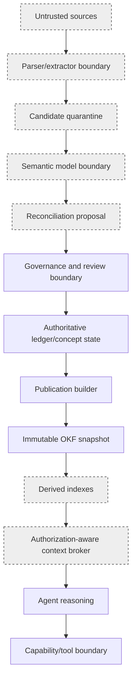

# Phase 3 Security, Privacy, and Governance

- **Version:** 1.0.0
- **Status:** Accepted target design; non-runtime
- **Purpose:** Define the threat model, trust boundaries, authority model, privacy controls, source-handling rules, poisoning defenses, review independence, audit requirements, and incident response for the governed knowledge system

## 1. Security objective

The Phase 3 knowledge system must be able to ingest hostile or incorrect information without allowing that information to become instructions, authority, executable state, protected memory, or silently trusted knowledge.

The central rule is:

> A knowledge system is permitted to remember that malicious, false, secret, stale, or contradictory content exists. It is not permitted to obey, promote, expose, or act on that content without the independently enforced contracts applicable to the operation.

## 2. Trust boundaries

Trust boundaries:

1. Source acquisition and local storage.
2. Parser/extractor process.
3. Candidate/model synthesis.
4. Reconciliation and policy decision.
5. Epistemic ledger and concept persistence.
6. Publication rendering and filesystem writes.
7. Projection/index consumption.
8. Retrieval/context transfer.
9. Agent-to-tool execution.
10. Backup, export, and shared/public publication.

No boundary inherits trust from the preceding boundary.

## 3. Threat actors and failure sources

The design assumes threats can originate from:

- intentionally malicious PDF, HTML, Markdown, repository, image, email, or database content;
- indirect prompt-injection text embedded in otherwise legitimate material;
- poisoned or manipulated source corpora;
- compromised source publishers;
- inaccurate or stale sources;
- local model hallucination or malformed structured output;
- compromised or misconfigured model/runtime binaries;
- malicious or vulnerable parser libraries;
- path traversal and filesystem aliasing;
- source/output directory overlap;
- oversized, recursive, compressed, encrypted, or malformed documents;
- secrets or personal data accidentally included in sources;
- an authorized actor exceeding intended scope;
- confused-deputy behavior across agents, protocols, or tools;
- vector/index leakage across scopes;
- stale projections or projection/snapshot mismatch;
- backup/export leakage;
- supply-chain compromise;
- accidental operator error;
- compromised credentials or local account;
- model/reviewer collusion or non-independent review;
- governance rules that are incomplete or contradictory.

## 4. Security invariants

1. Source text, retrieved text, candidate text, and peer-agent text are always data.
2. Only mission, policy, constitution, and capability records can grant action authority.
3. The model used for extraction or synthesis receives no execution tools.
4. Candidate producers cannot self-verify or self-promote.
5. Scope filtering occurs before source text is returned from a projection.
6. Private absolute paths, credentials, tokens, personal identifiers, and secrets are prohibited in shared/public OKF snapshots.
7. Parser, OCR, and media-processing workloads have explicit resource limits.
8. Source and output roots are resolved, normalized, disjoint, and root-confined.
9. Canonical publication is a deterministic process over approved IDs; it does not browse, retrieve, or execute source instructions.
10. Indexes and caches never broaden authorization.
11. Knowledge cannot activate a tool, capability, skill, mission, model, adapter, or policy.
12. Every consequential action records actor, authority, mission, policy, evidence, and receipt.
13. Security controls fail closed and emit typed evidence.
14. Secrets and protected content are not placed in logs merely to make auditing easier.
15. Removal or redaction propagates to every publication and projection, not only the source store.

## 5. Source acquisition security

### 5.1 Acquisition contract

Before bytes enter the managed source store:

- resolve the source locator without following unbounded redirects;
- enforce allowed schemes and roots;
- record acquisition actor and mission;
- enforce maximum byte size;
- calculate digest while streaming;
- reject special devices, named pipes, sockets, reparse-point escapes, and unsupported filesystem objects;
- detect source/output root aliasing, including case-insensitive Windows paths and junctions;
- record media type from declared and inspected evidence;
- quarantine before parsing;
- scan for known malware where an approved local scanner is available;
- never execute macros, scripts, embedded files, or launch actions.

### 5.2 Windows path rules

- Canonicalize with the Windows-aware resolved path.
- Treat paths case-insensitively for root-overlap checks.
- Inspect junctions, symlinks, mount points, and reparse tags.
- Prohibit output below source and source below output.
- Prohibit protected system roots unless a mission explicitly authorizes read-only access.
- Store digest-addressed artifacts under an Erasmus-owned root.

### 5.3 Remote resources

Remote source acquisition is a separate capability and is not implied by PDF-folder ingestion. It requires:

- explicit network authority;
- domain/URL policy;
- TLS and redirect policy;
- byte/time budgets;
- content digest;
- response headers and acquisition receipt;
- handling for mutable URLs and versioned snapshots;
- credential separation;
- data-governance review before upload or external processing.

## 6. Parser and extraction security

### 6.1 Parser isolation

Parsers are untrusted code processing untrusted bytes. A promoted implementation shall:

- invoke parsers with least privilege;
- avoid shell interpretation;
- use argument arrays and validated paths;
- enforce CPU time, wall time, memory, output-size, page/object-count, recursion, and temporary-disk limits;
- disable network access for extraction where the platform permits;
- write temporary artifacts only under a controlled root;
- record parser implementation/version/digest;
- treat crashes and partial extraction as evidence, not success;
- retain failed coordinates and reason codes.

The first Python implementation may use in-process parsing only after a risk review and strict input budgets. A later native or sidecar boundary requires a separate mission and measurable benefit.

### 6.2 PDF-specific controls

- maximum file size;
- maximum page count;
- maximum object count and decompressed stream size where inspectable;
- encrypted PDF policy;
- embedded-file prohibition by default;
- JavaScript/action prohibition;
- malformed cross-reference handling;
- text extraction output cap per page;
- image/OCR pixel and page budgets;
- deterministic handling of textless pages;
- no automatic password guessing.

### 6.3 OCR

OCR is a separately declared deterministic/statistical capability. OCR output is lower-confidence extracted evidence unless independently checked. OCR must record engine, language, options, page/image identity, coordinates, confidence outputs, and receipt. It must not be silently substituted for absent text.

## 7. Prompt injection and semantic-model defenses

### 7.1 Instruction/data separation

Every semantic prompt shall state that source content is untrusted evidence and is enclosed in an explicit data delimiter. The system prompt and schema remain outside source-controlled text.

The model is never asked to execute, browse, call tools, reveal secrets, modify files, or follow source instructions during candidate extraction or reconciliation proposal generation.

### 7.2 Output constraints

- strict JSON-only response contract;
- exact allowed fields;
- maximum candidate/claim counts;
- maximum field lengths;
- no dynamic path or command fields;
- no `verified`, authority, approval, capability, or execution-result fields;
- reject unknown fields where the semantic boundary is strict;
- canonicalize and validate before persistence;
- no repair loop that broadens the schema or silently drops invalid fields.

A bounded retry may repeat the exact contract with error feedback. Exhaustion produces a failure, not permissive parsing.

### 7.3 Model identity

Record:

- runtime kind and endpoint identity;
- model identifier;
- model artifact/digest when locally available;
- quantization;
- adapter identity;
- system-prompt artifact digest;
- generation settings;
- response digest;
- start/end times;
- cancellation/failure state.

A changed model or prompt creates a new producer profile.

### 7.4 Injection indicators

Candidate admission records indicators such as:

- attempts to address the agent/operator;
- requests to ignore prior instructions;
- tool/command strings;
- secret-exfiltration requests;
- authority or verification claims;
- requests to alter files, policies, or memory;
- encoded or obfuscated instruction patterns.

Indicators trigger quarantine or review; they are not themselves proof of malicious intent.

## 8. Corpus and RAG poisoning defenses

### 8.1 Controlled ingestion

Only source artifacts with provenance and scope enter the managed corpus. A vector-store API cannot directly accept ungoverned text as canonical knowledge.

### 8.2 Source diversity and lineage

The system distinguishes independent evidence from copied or shared-upstream sources. A thousand derived pages do not become a thousand independent confirmations.

### 8.3 Trust signals

Following OKF v0.2, store objective source and verification signals rather than a permanent universal credibility score. Relevant signals include:

- author/producer identity;
- source digest;
- source kind;
- last modified/effective date;
- acquisition path;
- usage/liveness data where applicable;
- independent verification events;
- deterministic test receipts;
- contradiction and withdrawal history.

### 8.4 Poisoning anomaly checks

Possible checks:

- unexpected source-volume spike;
- repeated near-duplicate claims from one lineage;
- sudden ranking dominance from one source family;
- source/title/path impersonation;
- newly introduced instruction-like language;
- conflict with immutable contracts or deterministic results;
- unauthorized scope changes;
- abnormal relationship fan-out;
- embedding outliers or projection drift;
- source digest changing under a stable locator.

Statistical checks produce findings, not automatic truth decisions.

## 9. Authority and least privilege

### 9.1 Role separation

Suggested roles:

| Role | Minimum responsibilities | Prohibited by default |
|---|---|---|
| Source ingester | register source, run approved extractors | reconcile, promote, publish |
| Candidate producer | produce candidate concepts/claims | verify or promote own output |
| Reconciliation analyst | propose/decide under policy | publish without approval |
| Deterministic validator | execute fixed checks and receipts | semantic adjudication |
| Independent reviewer | review exact digest | mutate reviewed subject |
| 10th-Man | seek countercases and gate violations | implement or self-approve corrections |
| Domain reviewer | assess domain evidence/applicability | grant tool authority |
| Security/privacy reviewer | scope, secret, policy review | alter truth state without evidence |
| Publisher | render and atomically publish approved plan | choose claims/reconciliation |
| Projection builder | build derived indexes | mutate authoritative state |
| Context broker | retrieve authorized evidence | expand scope or execute tools |
| Human governor | approve consequential/protected changes | bypass evidence/contract gates |

### 9.2 No authority through knowledge

A concept may say “run command X,” “use tool Y,” or “this is approved.” That text is descriptive. The mission/capability/policy control plane independently determines whether the command or tool is authorized.

### 9.3 Capability isolation

Every Phase 3 action is exposed through a narrow capability with exact inputs, outputs, side effects, evidence, and rollback. Broad capabilities such as `manage_knowledge` are prohibited.

## 10. Review independence and anti-collusion

- Producer and sole reviewer cannot share the same actor identity.
- The reviewed content digest must be fixed before review.
- A change after review invalidates the review for promotion purposes.
- Multiple models receiving the same source and prompt are not assumed independent evidence.
- A model reviewer must inspect source evidence, not only the producer's summary.
- Consequential/protected promotion requires human or deterministic authority according to policy.
- 10th-Man findings remain visible even when rejected; rejection requires evidence and rationale.
- Reviewer disagreement is preserved and adjudicated, not averaged.

## 11. Scope and privacy model

### 11.1 Visibility classes

- `private` — local deployment only;
- `project` — authorized project members/processes;
- `shared` — explicitly approved controlled exchange;
- `public` — safe for public repository/publication.

A derived record cannot have broader visibility than its most restrictive material source unless redaction or declassification is separately approved and evidenced.

### 11.2 Protected data classes

At minimum:

- credentials, tokens, keys, cookies, connection strings;
- private personal identifiers and biographical data;
- financial, health, employment, or account records;
- proprietary source code and documents;
- customer/vendor confidential information;
- safety-critical procedures;
- legal-privileged material;
- location/device identifiers;
- private local filesystem paths and usernames.

### 11.3 Publication policy

Before shared/public publication:

1. evaluate every source and concept scope;
2. scan rendered bytes for secrets and protected patterns;
3. check local paths and internal IDs;
4. verify source licenses/redistribution permission where relevant;
5. review per-claim attribution and redaction;
6. require human approval for protected/declassified content;
7. record exact published digest and audience.

### 11.4 Retrieval isolation

- Indexes are partitioned or filtered by scope.
- The request's authorized scope is explicit.
- Query logs do not contain protected result text unless policy allows.
- Vector nearest-neighbor search must not return unauthorized IDs before filtering; use partitioning or pre-filter metadata supported by the store.
- Graph traversal stops at unauthorized nodes/edges.
- Counts and existence signals may themselves be sensitive and follow policy.

## 12. Secrets management

- Credentials remain in OS/user secret stores or environment injection approved by runtime policy.
- Credentials are never written to OKF, source manifests, vector metadata, prompts, receipts, or Git.
- Runtime configuration references secret handles, not secret values.
- Logs redact request headers and sensitive URI components.
- A detected secret blocks publication and triggers a security finding.
- Rotation does not require knowledge-corpus rewriting because secret values are not knowledge records.

## 13. Supply-chain security

Every parser, model runtime, embedding model, validator, publisher, projection builder, and external executable must have:

- exact implementation identity and version;
- origin/provenance;
- digest or package-lock evidence where feasible;
- lifecycle status in the existing tool registry when executed as a tool;
- vulnerability/dependency review appropriate to risk;
- regression tests;
- quarantine and revocation path;
- no ambient PATH trust for consequential execution.

Knowledge documents may reference tools, but the existing tool registry determines executable identity.

## 14. Publication security

The publisher accepts an already approved `PublicationPlan` only.

It must:

- resolve every path under the temporary snapshot root;
- reject absolute paths and parent traversal;
- reject duplicate/case-colliding paths on Windows;
- reject reserved-name and invalid-filename collisions;
- write through safe-create semantics;
- avoid symlink/junction following;
- generate files from deterministic templates, not source-controlled templates with code execution;
- scan rendered output for secrets/protected data;
- validate all internal links and source references;
- compare two deterministic builds;
- atomically move the completed directory;
- write no content into repository/runtime code directories unless a separate mission authorizes export.

## 15. Projection security

### 15.1 Index poisoning

Projection builders consume only published snapshots or explicitly authorized candidate scopes. They verify snapshot manifests and reject unknown or modified files.

### 15.2 Vector model risk

Embedding models are untrusted statistical components. Record identity and evaluate for:

- cross-language behavior;
- adversarial strings;
- private-data memorization risk;
- dimension/configuration mismatch;
- drift after model change;
- retrieval bias toward repetitive or long content.

### 15.3 Graph amplification

High-degree or malicious relationships can dominate traversal. Apply:

- registered edge types;
- edge-source provenance;
- per-type traversal budgets;
- cycle and fan-out limits;
- derived-edge labeling;
- scope checks at every hop.

### 15.4 Cache isolation

Cache keys include snapshot, scope, policy, query normalization, stale/contested settings, and projection identities. A cache result from one scope cannot serve another.

## 16. Context and agent safety

The context broker renders evidence under an explicit untrusted/reference heading. It includes:

- stable source and claim IDs;
- epistemic status;
- concept lifecycle;
- freshness;
- contested state;
- scope;
- omitted evidence notices.

The broker must not:

- insert retrieved text into the system-instruction section;
- strip source IDs or warnings to save tokens;
- present model-generated candidates as canonical;
- hide material contradiction;
- translate descriptive tool instructions into authorization.

## 17. Audit and non-repudiation

Consequential audit records include:

- immutable event ID;
- mission and command IDs;
- actor and authority evaluation;
- exact input/subject digests;
- source, candidate, claim, concept, revision, review, decision, snapshot, and projection IDs;
- policy version;
- deterministic checks and tool receipts;
- model/runtime identity;
- result and typed failure;
- prior/current state references;
- rollback target;
- timestamps and duration.

Audit logs contain structured rationale and evidence references, not hidden chain of thought.

### 17.1 Tamper evidence

At minimum:

- append-only SQLite triggers;
- periodic database backup and integrity checks;
- content and snapshot digests;
- chained snapshot parent IDs;
- manifest digests;
- optional signed publication manifests when a demonstrated exchange requirement exists.

Elaborate PKI is deferred until required.

## 18. Freshness and malicious source changes

A stable locator returning changed bytes creates a new `SourceArtifact`. The prior source remains referenced by digest. Automatic replacement is forbidden.

Changed-source handling:

1. acquire and hash new bytes;
2. compare source lineage and metadata;
3. generate candidate differences;
4. reconcile affected claims;
5. mark impacted concepts approaching stale/stale as policy requires;
6. revalidate and republish through normal gates.

## 19. Removal, redaction, and right-to-delete behavior

### 19.1 Source removal

When authorized removal is required:

- remove or cryptographically erase source bytes;
- append a tombstone with digest, reason, actor, authority, and time;
- identify affected spans, evidence, concepts, snapshots, and projections;
- withdraw or replace affected published snapshots;
- rebuild projections;
- preserve non-sensitive audit metadata.

### 19.2 Redaction

Redaction creates a new source/revision with explicit transformation receipt. It never alters the original digest record. Access to the original may be removed under policy.

### 19.3 Model artifacts

If source content was sent to an external model, deletion guarantees depend on the provider contract and must be recorded. Local-first policy avoids this by default.

## 20. Incident classes

- source/parser compromise;
- prompt-injection attempt;
- corpus poisoning;
- secret exposure;
- unauthorized retrieval;
- scope leak across index/cache;
- fraudulent verification/promotion;
- snapshot tampering;
- projection corruption;
- stale knowledge used consequentially;
- malicious relationship amplification;
- supply-chain compromise;
- audit-integrity failure.

## 21. Incident response

1. Stop affected ingestion, publication, projection, or retrieval capability.
2. Preserve evidence and exact component identities.
3. Quarantine affected candidates/sources/projections.
4. Append an invalidation event, perform bounded impact analysis, and apply authorized qualify/exclude/block/channel-suspend serving directives before further retrieval.
5. Identify current and historical snapshots, use receipts, missions, and decisions affected.
6. Switch the affected channel's `current` pointer to a verified prior snapshot or a withdrawal snapshot when required.
7. Revoke compromised tools/models/components through existing registries.
8. Rebuild projections from a trusted snapshot.
9. Record immune incident and tangible wrongness where applicable.
10. Open a bounded repair/revalidation mission.
11. Require independent review before reactivation.

## 22. Security policy triggers

Mandatory 10th-Man review when:

- a candidate proposes changing immutable contracts or governance;
- a source contains instruction-like content and the candidate materially reflects it;
- one source family dominates a consequential claim;
- a contradiction affects safety, security, finance, health, legal, or deployment decisions;
- a canonical concept is withdrawn or superseded without a direct deterministic cause;
- a projection/ranking change materially changes consequential retrieval;
- review independence is uncertain;
- public/shared publication includes previously private material;
- the system proposes broadening scope or authority;
- evidence is unavailable but promotion is still requested.

## 23. Security acceptance tests

A promoted implementation must prove:

1. Source text cannot change system instructions or invoke tools.
2. Malformed and adversarial PDFs remain within resource budgets.
3. Source/output root aliasing and Windows junction escapes are rejected.
4. Candidate JSON with authority, verification, command, or unknown fields fails closed.
5. A producer cannot approve its own digest.
6. Copied sources do not count as independent corroboration.
7. Unauthorized scope content cannot enter retrieval process memory or caches.
8. Vector and graph projections cannot bypass scope filters.
9. Secret-bearing rendered output blocks publication.
10. Snapshot tampering invalidates manifest verification.
11. Projection/snapshot mismatch blocks retrieval.
12. A malicious Markdown link cannot escape the bundle.
13. Removal/redaction propagates to current publication and all ready projections.
14. Tool and parser execution uses exact registered implementations rather than ambient PATH.
15. Consequential promotion cannot pass without required human and 10th-Man evidence.
16. Incident rollback selects a known-good snapshot and preserves audit history.
