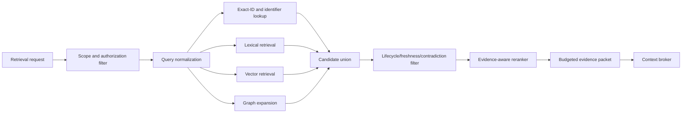

# Phase 3 Storage, Publication, Projection, and Retrieval Model

- **Version:** 1.0.0
- **Status:** Accepted target design; non-runtime
- **Purpose:** Fix the authoritative source of each record class, SQLite persistence boundaries, OKF publication behavior, projection rebuild rules, and bounded retrieval contracts

## 1. Architectural decision summary

Phase 3 uses an append-only operational ledger plus immutable publication snapshots.

- SQLite operational records are authoritative for live evidence, decisions, reviews, claim bindings, lifecycle transitions, publication receipts, and projection checkpoints.
- Source artifacts are authoritative evidence bytes or externally resolvable immutable resources identified by digest.
- The existing epistemic ledger is authoritative for proposition truth state.
- An immutable OKF snapshot is the authoritative portable publication for its exact snapshot revision.
- Lexical, vector, graph, cache, API, and UI stores are rebuildable projections.
- The mutable `current` pointer is only a selected-snapshot reference, not a corpus store.

This decision is recorded in [`../../adr/ADR-KNOWLEDGE-001-authoritative-state-and-okf-publication.md`](../../adr/ADR-KNOWLEDGE-001-authoritative-state-and-okf-publication.md).

## 2. Source-of-truth matrix

| Record class | Authoritative representation | Derived representations | Forbidden competing authority |
|---|---|---|---|
| Source bytes | Content-addressed local artifact or immutable external resource plus verified digest | extracted text, thumbnails, OCR, parsed structure | mutable path/URL alone |
| Source span | SQLite append-only span record plus extraction receipt | highlighted page, text chunk | model citation string alone |
| Evidence | Existing `epistemic_evidence` plus source/span links | OKF source entries, evidence packets | vector-store row |
| Proposition truth state | Existing propositions and append-only ledger transitions | concept status annotations, UI summaries | OKF `status` used as truth state |
| Candidate | Phase 3 quarantine tables or external Foundry bundle before import | candidate search cache | canonical OKF directory |
| Reconciliation decision | SQLite immutable decision record | audit report, decision view | model output |
| Concept identity/revision | SQLite concept and immutable revision records | OKF concept document | filename/title |
| Relationship | SQLite append-only relationship records | graph projection, Markdown links | embedding proximity |
| Review/promotion | SQLite immutable review and decision records | OKF `verified`, reports | PR comment alone |
| Published corpus | Immutable OKF snapshot directory and publication receipt | current pointer, archive ZIP | directly edited mutable folder |
| Lexical index | Projection manifest + FTS artifact | query results | canonical source |
| Vector index | Projection manifest + vector artifact | similarity results | canonical source |
| Graph index | Projection manifest + adjacency artifact | traversals/visualization | canonical source |
| Context packet | Immutable retrieval receipt | model prompt section | conversation transcript |

## 3. Operational SQLite model

The exact migration is deferred. The target record families below are normative for responsibility and relationships. Names may change only through a documented contract revision.

### 3.1 Source tables

```sql
CREATE TABLE knowledge_sources (
    source_id TEXT PRIMARY KEY,
    sha256 TEXT NOT NULL UNIQUE,
    media_type TEXT NOT NULL,
    byte_size INTEGER NOT NULL CHECK(byte_size >= 0),
    source_kind TEXT NOT NULL,
    locator TEXT NOT NULL,
    scope_json TEXT NOT NULL,
    storage_state TEXT NOT NULL,
    metadata_json TEXT NOT NULL,
    acquired_by TEXT NOT NULL,
    acquired_at TEXT NOT NULL
);

CREATE TABLE knowledge_extraction_receipts (
    receipt_id TEXT PRIMARY KEY,
    source_id TEXT NOT NULL,
    extractor_json TEXT NOT NULL,
    options_json TEXT NOT NULL,
    status TEXT NOT NULL,
    output_digest_json TEXT,
    detail_json TEXT NOT NULL,
    started_at TEXT NOT NULL,
    completed_at TEXT,
    FOREIGN KEY(source_id) REFERENCES knowledge_sources(source_id)
);

CREATE TABLE knowledge_source_spans (
    span_id TEXT PRIMARY KEY,
    source_id TEXT NOT NULL,
    coordinate_json TEXT NOT NULL,
    text_digest_json TEXT NOT NULL,
    extracted_text TEXT,
    protected_ref TEXT,
    extraction_receipt_id TEXT NOT NULL,
    scope_json TEXT NOT NULL,
    created_at TEXT NOT NULL,
    CHECK((extracted_text IS NULL) != (protected_ref IS NULL)),
    FOREIGN KEY(source_id) REFERENCES knowledge_sources(source_id),
    FOREIGN KEY(extraction_receipt_id)
        REFERENCES knowledge_extraction_receipts(receipt_id)
);
```

The source tables are append-only except for a separately governed storage-state projection. Tombstone and removal events are separate records.

### 3.2 Ingestion and candidate tables

```sql
CREATE TABLE knowledge_ingestion_runs (
    run_id TEXT PRIMARY KEY,
    mission_id INTEGER NOT NULL,
    idempotency_key TEXT NOT NULL UNIQUE,
    producer_profile TEXT NOT NULL,
    runtime_identity_json TEXT,
    budgets_json TEXT NOT NULL,
    status TEXT NOT NULL,
    checkpoint_json TEXT NOT NULL,
    failure_json TEXT,
    started_at TEXT NOT NULL,
    completed_at TEXT
);

CREATE TABLE knowledge_candidates (
    candidate_id TEXT PRIMARY KEY,
    run_id TEXT NOT NULL,
    producer TEXT NOT NULL,
    content_digest_json TEXT NOT NULL,
    title TEXT NOT NULL,
    proposed_type TEXT NOT NULL,
    description TEXT NOT NULL,
    body TEXT NOT NULL,
    tags_json TEXT NOT NULL,
    scope_json TEXT NOT NULL,
    risk_class TEXT NOT NULL,
    initial_disposition TEXT NOT NULL,
    created_at TEXT NOT NULL,
    FOREIGN KEY(run_id) REFERENCES knowledge_ingestion_runs(run_id)
);

CREATE TABLE knowledge_candidate_claims (
    candidate_claim_id TEXT PRIMARY KEY,
    candidate_id TEXT NOT NULL,
    statement TEXT NOT NULL,
    statement_digest TEXT NOT NULL,
    subject_json TEXT,
    predicate TEXT,
    object_json TEXT,
    qualifiers_json TEXT NOT NULL,
    source_span_ids_json TEXT NOT NULL,
    scope_json TEXT NOT NULL,
    risk_class TEXT NOT NULL,
    created_at TEXT NOT NULL,
    FOREIGN KEY(candidate_id) REFERENCES knowledge_candidates(candidate_id)
);

CREATE TABLE knowledge_candidate_transitions (
    transition_id TEXT PRIMARY KEY,
    candidate_id TEXT NOT NULL,
    prior_state TEXT,
    new_state TEXT NOT NULL,
    reason_code TEXT NOT NULL,
    evidence_json TEXT NOT NULL,
    actor TEXT NOT NULL,
    authority TEXT NOT NULL,
    created_at TEXT NOT NULL,
    FOREIGN KEY(candidate_id) REFERENCES knowledge_candidates(candidate_id)
);
```

Initial candidate content is immutable. Current disposition is derived from the latest transition.

### 3.3 Reconciliation tables

```sql
CREATE TABLE knowledge_comparison_targets (
    comparison_id TEXT PRIMARY KEY,
    candidate_claim_id TEXT NOT NULL,
    target_id TEXT NOT NULL,
    target_kind TEXT NOT NULL,
    target_revision TEXT,
    retrieval_features_json TEXT NOT NULL,
    compatibility_json TEXT NOT NULL,
    rank INTEGER NOT NULL,
    created_at TEXT NOT NULL,
    FOREIGN KEY(candidate_claim_id)
        REFERENCES knowledge_candidate_claims(candidate_claim_id)
);

CREATE TABLE knowledge_reconciliation_proposals (
    proposal_id TEXT PRIMARY KEY,
    candidate_claim_id TEXT NOT NULL,
    proposed_action TEXT NOT NULL,
    target_ids_json TEXT NOT NULL,
    reason_codes_json TEXT NOT NULL,
    rationale TEXT NOT NULL,
    deterministic_checks_json TEXT NOT NULL,
    model_identity_json TEXT,
    confidence REAL,
    created_at TEXT NOT NULL,
    FOREIGN KEY(candidate_claim_id)
        REFERENCES knowledge_candidate_claims(candidate_claim_id)
);

CREATE TABLE knowledge_reconciliation_decisions (
    decision_id TEXT PRIMARY KEY,
    proposal_id TEXT NOT NULL,
    action TEXT NOT NULL,
    candidate_claim_id TEXT NOT NULL,
    target_claim_ids_json TEXT NOT NULL,
    target_concept_ids_json TEXT NOT NULL,
    evidence_ids_json TEXT NOT NULL,
    review_ids_json TEXT NOT NULL,
    policy_version TEXT NOT NULL,
    actor TEXT NOT NULL,
    authority TEXT NOT NULL,
    mission_id INTEGER NOT NULL,
    idempotency_key TEXT NOT NULL UNIQUE,
    rationale TEXT NOT NULL,
    created_at TEXT NOT NULL,
    FOREIGN KEY(proposal_id)
        REFERENCES knowledge_reconciliation_proposals(proposal_id)
);
```

Decisions are append-only. A corrected decision is a new decision that supersedes the prior decision and references it explicitly.

### 3.4 Concept, revision, and relationship tables

```sql
CREATE TABLE knowledge_concepts (
    concept_id TEXT PRIMARY KEY,
    created_by TEXT NOT NULL,
    created_at TEXT NOT NULL,
    scope_json TEXT NOT NULL,
    risk_class TEXT NOT NULL
);

CREATE TABLE knowledge_concept_revisions (
    revision_id TEXT PRIMARY KEY,
    concept_id TEXT NOT NULL,
    revision_number INTEGER NOT NULL CHECK(revision_number > 0),
    parent_revision_id TEXT,
    title TEXT NOT NULL,
    concept_type TEXT NOT NULL,
    description TEXT NOT NULL,
    tags_json TEXT NOT NULL,
    claim_ids_json TEXT NOT NULL,
    relationship_ids_json TEXT NOT NULL,
    applicability_json TEXT NOT NULL,
    exclusions_json TEXT NOT NULL,
    okf_path TEXT NOT NULL,
    rendering_profile TEXT NOT NULL,
    content_digest_json TEXT NOT NULL,
    generated_by TEXT NOT NULL,
    generated_at TEXT NOT NULL,
    UNIQUE(concept_id, revision_number),
    FOREIGN KEY(concept_id) REFERENCES knowledge_concepts(concept_id),
    FOREIGN KEY(parent_revision_id)
        REFERENCES knowledge_concept_revisions(revision_id)
);

CREATE TABLE knowledge_claim_bindings (
    claim_id TEXT PRIMARY KEY,
    proposition_id INTEGER NOT NULL,
    binding_decision_id TEXT NOT NULL,
    statement_digest TEXT NOT NULL,
    scope_json TEXT NOT NULL,
    created_at TEXT NOT NULL,
    FOREIGN KEY(proposition_id) REFERENCES propositions(id),
    FOREIGN KEY(binding_decision_id)
        REFERENCES knowledge_reconciliation_decisions(decision_id)
);

CREATE TABLE knowledge_relationships (
    relationship_id TEXT PRIMARY KEY,
    from_id TEXT NOT NULL,
    relationship_type TEXT NOT NULL,
    to_id TEXT NOT NULL,
    qualifiers_json TEXT NOT NULL,
    evidence_ids_json TEXT NOT NULL,
    scope_json TEXT NOT NULL,
    created_by TEXT NOT NULL,
    created_at TEXT NOT NULL,
    supersedes_relationship_id TEXT,
    FOREIGN KEY(supersedes_relationship_id)
        REFERENCES knowledge_relationships(relationship_id)
);
```

A separate append-only lifecycle-transition table stores concept state changes. A `knowledge_concept_current` view or materialized projection may expose the latest revision and lifecycle.

### 3.5 Reviews and promotion tables

```sql
CREATE TABLE knowledge_reviews (
    review_id TEXT PRIMARY KEY,
    review_type TEXT NOT NULL,
    subject_ids_json TEXT NOT NULL,
    reviewer TEXT NOT NULL,
    independence_key TEXT NOT NULL,
    inputs_digest_json TEXT NOT NULL,
    verdict TEXT NOT NULL,
    findings_json TEXT NOT NULL,
    required_actions_json TEXT NOT NULL,
    evidence_ids_json TEXT NOT NULL,
    policy_version TEXT NOT NULL,
    created_at TEXT NOT NULL
);

CREATE TABLE knowledge_lifecycle_transitions (
    transition_id TEXT PRIMARY KEY,
    concept_id TEXT NOT NULL,
    revision_id TEXT NOT NULL,
    prior_state TEXT,
    new_state TEXT NOT NULL,
    evidence_ids_json TEXT NOT NULL,
    review_ids_json TEXT NOT NULL,
    actor TEXT NOT NULL,
    authority TEXT NOT NULL,
    policy_version TEXT NOT NULL,
    rollback_ref TEXT,
    reason TEXT NOT NULL,
    created_at TEXT NOT NULL,
    FOREIGN KEY(concept_id) REFERENCES knowledge_concepts(concept_id),
    FOREIGN KEY(revision_id)
        REFERENCES knowledge_concept_revisions(revision_id)
);
```

### 3.6 Publication tables

```sql
CREATE TABLE knowledge_snapshots (
    snapshot_id TEXT PRIMARY KEY,
    channel_id TEXT NOT NULL,
    sequence INTEGER NOT NULL,
    parent_snapshot_id TEXT,
    scope_json TEXT NOT NULL,
    status TEXT NOT NULL,
    manifest_digest_json TEXT,
    root_path TEXT NOT NULL,
    created_at TEXT NOT NULL,
    published_at TEXT,
    withdrawn_at TEXT,
    UNIQUE(channel_id, sequence),
    FOREIGN KEY(parent_snapshot_id)
        REFERENCES knowledge_snapshots(snapshot_id)
);

CREATE TABLE knowledge_snapshot_members (
    snapshot_id TEXT NOT NULL,
    concept_id TEXT NOT NULL,
    revision_id TEXT NOT NULL,
    okf_path TEXT NOT NULL,
    document_digest_json TEXT NOT NULL,
    PRIMARY KEY(snapshot_id, concept_id),
    UNIQUE(snapshot_id, okf_path),
    FOREIGN KEY(snapshot_id) REFERENCES knowledge_snapshots(snapshot_id),
    FOREIGN KEY(concept_id) REFERENCES knowledge_concepts(concept_id),
    FOREIGN KEY(revision_id)
        REFERENCES knowledge_concept_revisions(revision_id)
);

CREATE TABLE knowledge_publication_receipts (
    receipt_id TEXT PRIMARY KEY,
    snapshot_id TEXT NOT NULL,
    plan_json TEXT NOT NULL,
    publisher_json TEXT NOT NULL,
    validator_json TEXT NOT NULL,
    results_json TEXT NOT NULL,
    prior_pointer TEXT,
    resulting_pointer TEXT,
    status TEXT NOT NULL,
    failure_json TEXT,
    started_at TEXT NOT NULL,
    completed_at TEXT,
    FOREIGN KEY(snapshot_id) REFERENCES knowledge_snapshots(snapshot_id)
);
```

### 3.7 Projection and outbox tables

```sql
CREATE TABLE knowledge_projection_manifests (
    projection_id TEXT PRIMARY KEY,
    projection_kind TEXT NOT NULL,
    source_snapshot_id TEXT NOT NULL,
    builder_json TEXT NOT NULL,
    configuration_json TEXT NOT NULL,
    model_identity_json TEXT,
    scope_json TEXT NOT NULL,
    status TEXT NOT NULL,
    artifact_path TEXT,
    artifact_digest_json TEXT,
    failure_json TEXT,
    created_at TEXT NOT NULL,
    completed_at TEXT,
    FOREIGN KEY(source_snapshot_id)
        REFERENCES knowledge_snapshots(snapshot_id)
);

CREATE TABLE knowledge_outbox (
    outbox_id TEXT PRIMARY KEY,
    topic TEXT NOT NULL,
    aggregate_id TEXT NOT NULL,
    payload_json TEXT NOT NULL,
    status TEXT NOT NULL,
    attempts INTEGER NOT NULL DEFAULT 0,
    available_at TEXT NOT NULL,
    created_at TEXT NOT NULL,
    completed_at TEXT,
    failure_json TEXT
);
```

The outbox is written in the same transaction as authoritative state. Projection builders consume it idempotently.

## 4. Append-only enforcement

Consequential tables require no-update/no-delete triggers similar to the existing ledger and mission tables:

- source records after admission;
- extraction receipts;
- source spans;
- candidate transitions;
- reconciliation proposals and decisions;
- claim bindings;
- concept revisions;
- relationships;
- reviews;
- lifecycle transitions;
- snapshots and publication receipts;
- audit events.

Mutable operational fields such as retry count, lease expiration, or outbox status belong in explicitly operational tables and are not evidence records.

## 5. Transaction boundaries

### 5.1 Candidate import transaction

One transaction:

1. verify idempotency key;
2. register already-verified source references or reject missing sources;
3. insert candidate record;
4. insert candidate claims and source links;
5. append initial `quarantined` transition;
6. emit audit event/outbox item.

### 5.2 Reconciliation commit transaction

One transaction:

1. verify mission, actor, authority, policy, reviews, and expected revisions;
2. insert immutable reconciliation decision;
3. call ledger adapter operations;
4. create claim binding or evidence link;
5. create concept/revision/relationship records as needed;
6. append lifecycle transition when applicable;
7. write audit event and projection/publication outbox work.

If any step fails, no authoritative Phase 3 or ledger mutation commits.

### 5.3 Publication transaction split

Filesystem publication cannot share a SQLite transaction. Use a prepare/commit protocol:

1. **Prepare transaction:** create `building` snapshot, persist exact publication plan and rollback target.
2. **Build outside transaction:** render temporary directory and compute receipts.
3. **Validate outside transaction:** OKF, links, sources, privacy, secrets, deterministic rebuild.
4. **Approve transaction:** append approval and mark snapshot `approved`.
5. **Atomic filesystem swap:** move temporary directory to immutable snapshot path and atomically update `current` pointer.
6. **Commit transaction:** persist success receipt and mark `published`.
7. If step 6 fails after pointer swap, recovery compares pointer and receipt, then either completes the transaction or restores the prior pointer. It never guesses.

## 6. Filesystem snapshot layout

```text
state/
└── knowledge/
    ├── sources/
    │   └── sha256/
    │       └── ab/
    │           └── cd/
    │               └── <full-digest>
    ├── channels/
    │   ├── private-default/
    │   │   ├── current.json
    │   │   ├── snapshots/
    │   │   │   ├── 00000041-<snapshot-uuid>/
    │   │   │   │   ├── index.md
    │   │   │   │   ├── log.md
    │   │   │   │   ├── concepts/
    │   │   │   │   ├── references/
    │   │   │   │   └── _erasmus/
    │   │   │   │       ├── snapshot-manifest.json
    │   │   │   │       ├── publication-receipt.json
    │   │   │   │       └── source-map.json
    │   │   │   └── 00000042-<snapshot-uuid>/
    │   │   └── projections/
    │   │       ├── fts/
    │   │       ├── vector/
    │   │       └── graph/
    │   ├── project-<id>/
    │   │   ├── current.json
    │   │   ├── snapshots/
    │   │   └── projections/
    │   └── public/
    │       ├── current.json
    │       ├── snapshots/
    │       └── projections/
    └── work/
        └── <temporary-build-id>/
```

Rules:

- Snapshot directories are immutable after publication.
- `work/` is never a retrieval source.
- Each publication channel has an independent `current.json` containing channel ID, snapshot ID, sequence, manifest digest, policy/registry profile IDs, and update receipt ID.
- Source storage paths derive from digest, never from untrusted filenames.
- Snapshot roots and source roots are disjoint.
- Published OKF source links use relative references only when the referenced artifact is intentionally included in the snapshot.

### 6.1 Publication channel isolation

Snapshot sequence, current pointer, projection root, policy, scope, renderer, retention, redaction, and rollback are isolated per `PublicationChannel`. Publishing or rolling back one channel must not modify another. A retrieval request selects a channel explicitly or through deterministic policy before projection access.

The channel contract and activation rules are defined in [`POLICY_IDENTITY_AND_REGISTRIES.md`](POLICY_IDENTITY_AND_REGISTRIES.md).

## 7. Canonical rendering and reproducibility

### 7.1 Rendering input

The publisher receives only stable IDs and exact revisions. It does not perform open-ended retrieval during rendering.

### 7.2 Deterministic order

- concepts ordered by normalized path;
- frontmatter keys emitted according to a versioned order or canonical YAML profile;
- tags and unordered ID collections sorted deterministically;
- claim sections ordered by explicit revision order, then stable ID;
- source entries ordered by source ID;
- relationships ordered by type then target ID;
- LF line endings and UTF-8;
- one terminal newline;
- no environment-dependent timestamps except declared generation events already persisted in the plan.

### 7.3 Rebuild proof

Before publication, the same plan is rendered twice into separate temporary directories. File lists and byte digests must match. A mismatch is `publication_non_deterministic` and blocks publication.

## 8. OKF snapshot profile

### 8.1 Root index

The root `index.md` declares:

```yaml
---
okf_version: "0.2"
erasmus:
  profile: erasmus.knowledge-bundle/v1
  snapshot_id: urn:erasmus:snapshot:...
  sequence: 42
  manifest_digest: ...
  scope: project
---
```

### 8.2 `log.md`

`log.md` is a chronological, human-readable projection of publication changes. It is not the authoritative audit log. Each entry links to snapshot and decision IDs.

### 8.3 Concept sources

External source URLs may appear where scope permits. Local private absolute paths must not appear in public or shared snapshots. Local artifacts included under `references/` use relative paths and digest-addressed filenames.

### 8.4 Unknown metadata

When importing an OKF concept, unknown fields are retained in the candidate import record and round-tripped unless policy rejects them. They do not affect governance until registered.

## 9. Lexical projection

### 9.1 Default implementation

SQLite FTS5 is the first authorized lexical projection because it is local, deterministic, inspectable, and already aligned with Erasmus's SQLite tooling.

Indexed fields:

- concept title;
- description;
- body sections;
- claim statements;
- tags;
- relationship labels;
- source titles;
- stable IDs and prior paths.

Each FTS row includes source snapshot, concept, revision, claim, lifecycle, scope, and freshness references outside or alongside the tokenized text.

### 9.2 Rebuild

The FTS database is built from one immutable snapshot. On completion it is integrity-checked, queried with deterministic fixtures, checksummed, and atomically registered as ready.

## 10. Vector projection

### 10.1 Role

Embeddings improve semantic recall. They do not establish identity, credibility, truth, contradiction, or authority.

### 10.2 Embedding units

Prefer claim-level and section-level embeddings with references to the complete concept and sources. Avoid embedding whole large documents as the only unit.

### 10.3 Manifest requirements

Record:

- embedding model and digest;
- runtime and quantization;
- normalization method;
- input rendering profile;
- vector dimension and distance metric;
- chunking/selection policy;
- source snapshot;
- artifact digest;
- evaluation results.

Changing any material setting creates a new projection; it does not mutate the old projection in place.

### 10.4 Candidate implementation

The design permits an embedded/local implementation such as LanceDB or another validated store, but does not authorize a dependency. The vector adapter contract must make the store replaceable.

## 11. Graph projection

### 11.1 Role

The graph projection supports multi-hop traversal, dependency and provenance exploration, contradiction sets, concept/claim/evidence navigation, and bounded context assembly.

### 11.2 Node classes

- concept;
- concept revision;
- claim/proposition;
- source artifact;
- source span;
- evidence;
- relationship;
- contradiction set;
- review;
- decision;
- snapshot;
- project/domain/tool/model/runtime entities when explicitly represented.

### 11.3 Edge classes

Edges originate from authoritative relationship and binding records. The graph builder may add derived edges such as `co_occurs_in_snapshot`, but derived edges are labeled and cannot drive policy without validation.

### 11.4 Implementation posture

Start with SQLite adjacency/materialized edge tables or an embedded graph structure. A remote graph service is not required and must not be placed on the hot path without a separately demonstrated need.

## 12. Retrieval pipeline



### 12.0 Serving-directive gate

Before projection content is materialized, the broker resolves the active directive-set digest for the selected channel, scope, policy, and time. Applicable `exclude`, `block`, or `channel_suspend` directives remove or stop affected results; `qualify` directives are retained in the evidence packet and context rendering.

Directive evaluation occurs before caches and model context, and cache keys include the directive-set digest. The authoritative contracts and invalidation behavior are defined in [`UNCERTAINTY_IMPACT_AND_SERVING_CONTROLS.md`](UNCERTAINTY_IMPACT_AND_SERVING_CONTROLS.md).

### 12.1 Authorization first

The broker determines allowed scopes and snapshot before issuing index queries. It must not retrieve a protected candidate and filter it only after content has entered process memory.

### 12.2 Query normalization

Extract:

- stable IDs and exact identifiers;
- project/domain scope;
- time/version/applicability constraints;
- desired claim/concept types;
- stale and contested policy;
- source requirements;
- maximum evidence/token budget.

A model may assist normalization, but deterministic explicit constraints override it.

### 12.3 Candidate generation

Default strategy:

1. exact ID/path/alias matches;
2. lexical FTS candidates;
3. vector candidates when enabled;
4. graph neighbors for selected seeds;
5. deterministic deduplication by stable claim/concept ID.

### 12.4 Filtering

Filter by:

- authorized scope;
- selected snapshot;
- active serving directives;
- concept lifecycle;
- claim epistemic state;
- source availability;
- freshness policy;
- temporal and applicability constraints;
- contradiction policy;
- risk class.

### 12.5 Reranking

Reranking may combine:

```text
relevance
+ exact_identifier_bonus
+ source_availability
+ evidence_strength
+ freshness
+ scope/applicability_fit
+ relationship_path_value
+ source_diversity
- contradiction_penalty_or_expansion_cost
- stale_penalty
- projection_uncertainty
```

Trust is inferred from source and verification signals. Do not store or promote a universal credibility scalar.

### 12.6 Contradiction-aware retrieval

When a selected claim belongs to an open contradiction set:

- include the contested flag;
- include materially relevant opposing claim IDs within budget;
- include resolution state;
- avoid synthesizing one side as uncontested;
- for consequential use, fail closed when the packet cannot include enough evidence to represent the disagreement.

### 12.7 Evidence packet budgeting

Budget priority:

1. exact claim statement and status;
2. decisive source spans;
3. contradiction/opposing evidence;
4. applicability and exclusions;
5. concept summary;
6. related background.

Truncation records omitted counts and reasons. It never silently drops the fact that a claim is contested or stale.

## 13. Context broker integration

The existing bounded-context assembler currently accepts retrieved evidence as `content` plus `source_ref`. Phase 3 should add a versioned adapter that renders `EvidencePacket` items into that existing section without weakening the instruction/data boundary.

Target rendering:

```text
source_ref=<claim-id>
concept=<concept-id>@<revision>
status=<ledger-status>
lifecycle=<concept-lifecycle>
freshness=<freshness>
contested=<true|false>
source_spans=<ids>
content=<selected text>
```

The existing `REFERENCE CONTEXT ONLY` boundary remains mandatory.

## 14. Freshness and revalidation storage

Target tables:

```sql
CREATE TABLE knowledge_freshness_assessments (
    assessment_id TEXT PRIMARY KEY,
    subject_id TEXT NOT NULL,
    source_signals_json TEXT NOT NULL,
    status TEXT NOT NULL,
    reason_codes_json TEXT NOT NULL,
    assessor_json TEXT NOT NULL,
    receipt_json TEXT NOT NULL,
    recommended_action TEXT NOT NULL,
    created_at TEXT NOT NULL
);

CREATE TABLE knowledge_revalidation_requests (
    request_id TEXT PRIMARY KEY,
    subject_ids_json TEXT NOT NULL,
    reason TEXT NOT NULL,
    risk_class TEXT NOT NULL,
    required_sources_json TEXT NOT NULL,
    required_validators_json TEXT NOT NULL,
    deadline TEXT,
    retry_budget INTEGER NOT NULL,
    fallback_behavior TEXT NOT NULL,
    mission_id INTEGER,
    status TEXT NOT NULL,
    created_at TEXT NOT NULL
);
```

A freshness assessment does not mutate concept or ledger state. A governed lifecycle or ledger command uses it as evidence.

## 15. Backup, restore, and disaster recovery

A complete backup includes:

- SQLite database through the existing hot-backup mechanism;
- content-addressed source artifacts permitted by policy;
- immutable OKF snapshots;
- publication receipts;
- projection manifests, although projection artifacts themselves may be omitted because they are rebuildable;
- configuration/policy versions required to reproduce publication.

Restore procedure:

1. restore SQLite and run integrity check;
2. verify source artifact digests;
3. verify snapshot manifests and receipts;
4. restore or select a published snapshot pointer;
5. discard projection artifacts whose source snapshot/configuration does not match;
6. rebuild projections;
7. run retrieval and publication fixture checks;
8. record restore evidence.

## 16. Data retention and removal

- Audit metadata, digests, decisions, and state transitions are retained according to policy.
- Source bytes may be removed or cryptographically erased when privacy/legal policy requires it.
- Removed content is represented by a tombstone containing digest, scope, removal reason, authority, actor, and affected records.
- Published snapshots containing removed protected content are withdrawn and replaced by redacted snapshots.
- Vector and lexical projections are rebuilt; deletion from one projection alone is insufficient.

## 17. Projection integrity rules

A projection is usable only when:

- its status is `ready`;
- its source snapshot is published and allowed for the request scope;
- its artifact digest verifies;
- its builder/configuration are recognized;
- it has passed required deterministic fixtures;
- it has not been marked stale or retired;
- its model identity is available for vector projections;
- its row/document count reconciles with the snapshot manifest within declared rules.

If a projection fails, the broker may fall back to another ready projection or exact snapshot scanning within budget. It may not return an unqualified empty result as proof that knowledge does not exist.

## 18. Performance targets

Targets apply only after correctness gates:

- exact-ID lookup: p95 below 50 ms locally;
- lexical retrieval over the personal corpus: p95 below 250 ms;
- hybrid retrieval with graph expansion: p95 below 1 second for normal interactive queries;
- publication of unchanged snapshot input: byte-identical output;
- projection crash recovery: no authoritative-state loss;
- offline operation: full exact/lexical retrieval and snapshot access without network;
- memory budgets and corpus scale are declared per mission rather than assumed unlimited.

## 19. Storage acceptance tests

A promoted implementation must prove:

1. Append-only triggers reject mutation and deletion of consequential records.
2. Source IDs match bytes and detect mutable-path changes.
3. Span identities and extraction receipts reproduce evidence.
4. Reconciliation commits are atomic with ledger operations.
5. Stale revision writes fail without partial state.
6. Snapshot build and current-pointer swap recover correctly at every injected failure point.
7. Identical plans render byte-identical snapshots.
8. FTS/vector/graph projections rebuild from a snapshot without access to prior projection artifacts.
9. A projection from the wrong snapshot is rejected.
10. Authorization filtering occurs before content return.
11. Contested and stale flags survive retrieval and context rendering.
12. Backup/restore reproduces the current snapshot and retrieval fixtures.
13. Protected-source removal propagates through snapshots and projections without erasing audit metadata.
