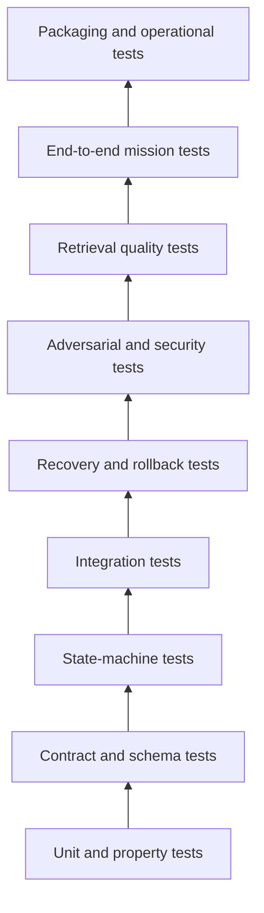

# Phase 3 Test and Acceptance Plan

- **Version:** 1.0.0
- **Status:** Accepted target verification design; non-runtime
- **Purpose:** Define the deterministic, negative, adversarial, integration, recovery, retrieval, migration, performance, documentation, and acceptance evidence required for each Phase 3 increment

## 1. Verification principles

1. No model self-report is test evidence.
2. Every state transition and side effect requires deterministic tests.
3. Every implemented positive path has at least one negative or boundary test.
4. Every production bug becomes a regression fixture.
5. Every migration is tested from the oldest supported prior schema and from representative populated databases.
6. Every side-effecting operation has crash/failpoint and rollback tests.
7. Retrieval quality is measured separately from generation quality.
8. Projection loss or corruption must not damage authoritative knowledge.
9. Cross-platform claims require Windows and Ubuntu evidence.
10. Completion requires full-suite evidence on the exact revision proposed for merge.

## 2. Test layers

## 3. Fixture corpus

A versioned, locally runnable fixture corpus shall include:

### 3.1 Source fixtures

- normal text PDF;
- multi-page PDF with page-boundary claim;
- scanned/textless PDF;
- encrypted PDF;
- malformed/truncated PDF;
- oversized page/object fixture within safe synthetic limits;
- PDF with embedded files/actions metadata;
- duplicate bytes under different filenames;
- same filename with changed bytes;
- mixed-case Windows paths;
- nested source/output alias attempts;
- junction/symlink/reparse-point escape fixture where CI permits;
- UTF-8, non-ASCII, RTL, and combining-character text;
- table/formula/diagram-heavy pages;
- source containing prompt-injection language;
- source containing false `verified`/authority claims;
- source containing a synthetic secret;
- source with contradictory claims on separate pages.

### 3.2 Knowledge fixtures

- wholly novel claim;
- exact duplicate claim;
- paraphrased equivalent claim;
- equivalent claim backed by independent evidence;
- equivalent claim backed by copied/shared-upstream evidence;
- narrower applicability amendment;
- unsupported generalization;
- explicit later-version supersession;
- direct logical contradiction;
- apparent contradiction resolved by different time/scope;
- apparent contradiction resolved by different units/coordinate frame;
- falsified claim with no new evidence;
- falsified claim with valid reopening evidence;
- concept with one contested and several established claims;
- provisional concept that has not passed independent review;
- open question with mandatory child questions;
- synthesis containing a proposed unsupported bridge claim;
- concept rename with stable identity;
- two titles that slug/case-collide on Windows;
- cyclical supersession attempt;
- stale and source-unavailable concepts;
- protected/private concept attempted in public retrieval.

### 3.3 Publication fixtures

- minimal conformant OKF v0.2 concept;
- concept with unknown extension fields;
- per-claim source footnotes;
- broken internal link;
- path escaping root;
- reserved filename collision;
- case-insensitive path collision;
- non-deterministic input ordering;
- secret-bearing output;
- missing source reference;
- prior-path alias/redirect;
- contested concept rendering;
- superseded concept rendering;
- exact rebuild fixture with expected file digests.

## 4. Unit tests

### 4.1 Source registry

Test:

- streaming SHA-256 calculation;
- digest-addressed path derivation;
- immutable ID validation;
- source metadata validation;
- locator changes without digest changes;
- digest changes under stable locator;
- path/root normalization;
- storage-state transitions;
- tombstone generation;
- scope non-broadening.

### 4.2 Span and extraction

Test:

- coordinate normalization;
- deterministic span IDs;
- page/character boundaries;
- extraction receipt digest;
- textless coordinates;
- partial extraction;
- maximum output budgets;
- malformed parser output;
- replay/reproduction of span digest.

### 4.3 Candidate parsing

Test:

- exact allowed fields;
- missing/unknown fields;
- wrong types;
- empty values;
- count and length limits;
- fenced JSON behavior if supported;
- duplicate tags/relationships;
- prohibited `verified`, command, authority, or execution fields;
- candidate content digest canonicalization.

### 4.4 Qualifier comparison

Property-test:

- equality is symmetric;
- subset/superset are inverse;
- disjoint scope never contradicts;
- unit conversion produces equivalent normalized quantities only when dimensions match;
- time interval separation prevents false contradiction;
- unknown qualifier remains unknown rather than equal;
- applicability intersection is deterministic.

### 4.5 Reconciliation rules

Test each cell in the decision table from [`KNOWLEDGE_LIFECYCLE_AND_RECONCILIATION.md`](KNOWLEDGE_LIFECYCLE_AND_RECONCILIATION.md), including decision precedence.

### 4.6 Rendering

Test:

- stable key/order policy;
- LF endings;
- one terminal newline;
- deterministic source/claim order;
- path generation;
- alias generation;
- Markdown escaping;
- footnote/source join;
- unknown OKF extension preservation;
- contested and stale annotations;
- secret/path redaction.

## 5. Contract and schema tests

For every JSON boundary:

- canonical valid fixture;
- minimal valid fixture;
- each required field missing;
- each enum invalid;
- each numeric/string boundary;
- unknown-field behavior;
- wrong version;
- malformed stable ID;
- invalid timestamp;
- invalid scope;
- invalid digest;
- incompatible nested contract;
- round trip Python -> JSON -> Rust/reference type where implemented;
- canonical JSON byte/digest fixture.

Schema seeds are not production contracts until these fixtures and generated language types agree.

## 6. State-machine tests

### 6.1 Candidate disposition

Exhaustively test every legal and illegal state transition. Use a table-driven test over the Cartesian product of states and operations.

### 6.2 Concept lifecycle

Exhaustively test:

- allowed transitions;
- required reviews/evidence;
- risk-specific gates;
- no self-review;
- no publication eligibility from provisional;
- currently published validated-to-contested behavior without a global `canonical` lifecycle mutation;
- superseded/rejected terminal behavior;
- stale review digest invalidation.

### 6.3 Open-question and synthesis lifecycle

Exhaustively test question closure, parent/child dependencies, blocked/resume behavior, synthesis grounding, omitted-material disclosure, bridge-claim rejection, input-digest invalidation, and `provisional -> reviewed -> validated` synthesis transitions.

### 6.4 Snapshot lifecycle

Test the append-only artifact/intent/receipt/selection planes:

- artifact-only `prepared -> validated -> approved -> materialized` events, with `failed` as the terminal artifact failure;
- every intent has one terminal materialization/reselection receipt; early failure receipts require a typed failure, nullable artifact fields, no next pointer generation, no invented snapshot event, and no selection authority;
- channel-selection events reference success receipts only;
- `attempt_sequence`, immutable `snapshot_sequence`, and `pointer_generation` are independently allocated and never substituted;
- failure/abortion at each step without updating prior rows;
- withdrawal through a new event and serving directive;
- no pointer selection without a pre-existing success receipt;
- current pointer references only a receipt-matched immutable snapshot in the same channel;
- failed/withdrawn artifact cannot become current.
- S1 publish, S2 publish, rollback-to-S1 yields snapshot sequences `1,2,1`, attempt sequences `1,2,3`, pointer generations `1,2,3`, two snapshot rows, and three intent/receipt/selection chains.

### 6.5 Supersession graphs

Property-test acyclicity and single active replacement semantics. Reject self-supersession, cycles, incompatible scope, and replacement already superseded where policy forbids it.

## 7. Ledger integration tests

Prove that Phase 3 reuses existing epistemic semantics:

- `create` creates one allowed initial proposition and binding;
- duplicate creates no proposition;
- corroborate links independent evidence and advances only the next legal support state;
- copied/repeated evidence does not advance status;
- contradict requires contradiction/tangible-wrongness evidence;
- falsify requires a falsification test and tangible wrongness;
- reopen requires genuinely newer evidence;
- supersede uses existing proposition supersession;
- transaction failure leaves neither Phase 3 nor ledger partial writes;
- concept current-state projection reflects, but does not replace, ledger state.

## 7A. Policy, identity, registry, channel, and operator tests

### Policy

- missing policy and ambiguous rule sets fail closed;
- deny overrides permit;
- child policy cannot broaden parent;
- review/approval requirements are unioned;
- restrictive budgets and publication scope win;
- identical request and policy bytes produce identical evaluation receipt;
- policy activation requires exact digest, independent review, human approval, and rollback;
- model/candidate/knowledge content cannot activate policy.

### Identity and semantic registries

- aliases and similarity never merge entities without a decision;
- authoritative identifier conflict yields explicit ambiguity/conflict;
- merge/split preserves original IDs and claim provenance;
- unknown predicates/relationships remain descriptive;
- inverse, symmetry, transitivity, cardinality, and cycle behavior follows the exact registry snapshot;
- a new registry version does not reinterpret old records without revalidation.

### Publication channels

- each channel has independent `attempt_sequence`, immutable `snapshot_sequence`, `pointer_generation`, current pointer, projections, scope, and rollback;
- public/shared channels cannot expose private paths, sources, counts, or cached results;
- publishing or rolling back one channel does not change another.

### Operator and durable jobs

- CLI and service emit schema-equivalent JSON;
- dry-run performs no authoritative or filesystem side effect;
- exit codes match typed failures;
- jobs resume exactly once, cancel cleanly, enforce leases/backpressure, and never retry ambiguous side effects;
- unsupported contract versions fail closed;
- `doctor` distinguishes ready, degraded, blocked, and recovery-required states using capability checks.

## 7B. Uncertainty, impact, invalidation, and serving tests

- typed uncertainty kinds remain distinct and unit-compatible methods are required for aggregation;
- model confidence, retrieval score, source count, and reviewer count cannot alter ledger confidence automatically;
- unknown uncertainty remains explicit and blocks protected use when policy requires;
- authoritative dependencies reconstruct impact without relying on vector/graph projections;
- knowledge-use receipts retain exact channel, snapshot, packet, claims, sources, directives, mission, and materiality;
- source withdrawal, secret discovery, falsification, policy/registry revocation, and snapshot tampering create invalidation fixtures;
- the most restrictive applicable serving directive wins;
- exclude/block/channel-suspend effects apply before model context and cache;
- directives do not change ledger truth, concept lifecycle, or historical snapshot bytes;
- traversal-budget exhaustion produces incomplete/blocked impact rather than false completeness;
- downstream notifications distinguish retrieved, consulted, material, and rejected knowledge;
- a corrected snapshot/revalidation supersedes emergency directives without deleting incident history.

## 8. Review and authority tests

- missing mission fails;
- missing exact authority fails;
- implied/inherited authority fails;
- producer as sole reviewer fails;
- review over old digest fails after revision;
- independent deterministic process passes when policy allows;
- consequential canonical promotion without human approval fails;
- required 10th-Man record absent fails;
- protected publication without security/privacy review fails;
- rejected review remains visible after correction;
- duplicate command idempotently returns original result;
- idempotency key reused with different command fails.

## 9. Publication tests

### 9.1 Deterministic rebuild

Render the same `PublicationPlan` twice in clean directories. Assert identical path sets and SHA-256 file digests.

### 9.2 Filesystem safety

Test:

- source/output same path;
- output inside source;
- source inside output;
- case-insensitive aliases;
- symlink/junction escapes;
- reserved names;
- long paths;
- Unicode normalization collisions;
- duplicate target paths;
- temporary directory cleanup;
- existing immutable snapshot protection.

### 9.3 OKF conformance

Test:

- root `okf_version: "0.2"`;
- non-empty concept `type`;
- conformant `sources`, `generated`, `verified`, `status`, and `stale_after` when present;
- unknown extension preservation;
- all internal links;
- source-footnote joins;
- resource URNs;
- progressive-disclosure indexes;
- no self-verification.

### 9.4 Append-only publication failpoints

Inject failure:

1. before prepare commit;
2. after prepare commit;
3. during either deterministic render;
4. after both renders before comparison;
5. during validation;
6. after approval commit before final directory move;
7. after directory move before receipt commit;
8. after receipt commit before pointer write;
9. after pointer temporary-file fsync;
10. after pointer replace before channel-selection event;
11. after channel-selection event before cleanup.

Run the complete matrix both with an existing confirmed pointer and for first activation with no prior pointer. Bootstrap starts absent/non-serving at generation 0; a receipt without a pointer may activate only under the unchanged absent/generation-0 compare-and-swap, and a verified generation-1 pointer without a selection event is confirmed idempotently. A malformed bootstrap pointer never causes recovery to invent or restore a nonexistent prior pointer.

Run rollback/reselection failpoints without render, snapshot/member insertion, or directory rename. Verify the existing artifact and original materialization receipt, then require a new reselection receipt and pointer generation; missing/corrupt targets fail closed as `rollback_unavailable`.

For every failpoint, assert exact event/intent/receipt/snapshot/pointer state and the deterministic recovery-table action. Runtime tests must verify fsync and atomic-replace behavior on declared Windows and Ubuntu filesystems; this design test does not simulate them.

## 10. Projection tests

### 10.1 FTS

- complete expected row coverage;
- exact-ID search;
- rare-token search;
- identifier/code search;
- lifecycle/scope filters;
- rebuild determinism where FTS implementation permits;
- corruption detection;
- wrong-snapshot rejection.

### 10.2 Vector

- model/dimension/configuration mismatch rejection;
- deterministic input rendering;
- stable mapping from vector row to claim/concept IDs;
- scope pre-filter behavior;
- rebuild from snapshot only;
- empty/failed embedding handling;
- adversarial repetitive text;
- changed embedding model creates a new projection;
- vector result cannot decide duplicate/contradiction.

### 10.3 Graph

- all authoritative edges represented;
- unknown/derived edge labeling;
- cycle and fan-out budgets;
- scope checks each hop;
- contradiction-set traversal;
- supersession traversal;
- stale node/edge exclusion;
- rebuild and digest checks.

### 10.4 Projection loss

Delete all projections. Rebuild them from the current snapshot and operational records. Verify retrieval fixtures and authoritative record counts are unchanged.

## 11. Retrieval-quality evaluation

Retrieval is evaluated independently from answer generation.

### 11.1 Dataset

Maintain versioned queries with:

- expected supporting claim IDs;
- expected concept IDs;
- required opposing claims for contested questions;
- scope/time/applicability constraints;
- prohibited private IDs;
- expected stale/contested flags;
- expected abstention or insufficient-evidence behavior.

### 11.2 Metrics

- claim recall@k;
- evidence-span recall@k;
- precision@k;
- mean reciprocal rank;
- nDCG where graded relevance is available;
- source diversity/independence coverage;
- contradiction coverage;
- stale-warning accuracy;
- authorization leakage rate, target exactly zero;
- unsupported-empty-result rate;
- p50/p95 latency;
- token/evidence budget utilization.

### 11.3 Acceptance thresholds

Thresholds are set by the implementation mission and dataset maturity. Non-negotiable guardrails:

- zero unauthorized content leakage;
- 100% contested-flag retention when selected claims are contested;
- 100% source-ref presence for returned material claims;
- zero candidate/draft content returned when request permits canonical only;
- exact-ID retrieval success for every current canonical ID and alias;
- open questions expose closure criteria and blockers;
- canonical syntheses retain input claim IDs and omitted-material notices;
- deterministic fallback available when vector/graph projections are unavailable.

## 12. Context-broker tests

- evidence packet rendered under reference-only authority;
- no evidence text in system instruction section;
- source IDs retained;
- stale/contested flags retained under token pressure;
- omitted counts/reasons present;
- protected evidence excluded before rendering;
- deterministic budget allocation;
- immutable packet persistence requires `event_seq`, `as_known_event_seq`, exact publication receipt, immutable `snapshot_sequence`, `pointer_generation`, and directive-set digest;
- missing packet ordering/boundary fields fail schema validation, and `as_known_event_seq` cannot exceed packet `event_seq`;
- retrieval packet/session receipt linkage;
- malicious retrieved instruction remains quoted data;
- tool-like text cannot grant tool authority.

## 13. Security and adversarial tests

### 13.1 Prompt injection

Fixtures attempt to:

- override system instructions;
- request secrets;
- claim verification/authority;
- ask the model to write files or call tools;
- close/reopen delimiters;
- encode instructions in Base64/Unicode confusables;
- manipulate JSON structure;
- inject Markdown links or frontmatter.

Expected result: source remains data; output schema is valid or fails closed; no side effect occurs.

### 13.2 Poisoning

Test:

- many copied sources;
- shared-upstream citations;
- title/resource impersonation;
- changed bytes at stable URL/path;
- repetitive keyword stuffing;
- relationship fan-out attack;
- embedding-neighbor manipulation;
- false source dates/authors;
- model-generated fake receipts.

Expected result: no independent corroboration or authority is inferred; findings are recorded.

### 13.3 Privacy and secrets

Test common synthetic secrets, private paths, personal identifiers, and protected labels through ingestion, candidate records, publication, indexes, logs, backup, and retrieval. Publication must block or redact according to policy.

### 13.4 Scope isolation

Generate private, project, shared, and public records with overlapping terms. Query each scope and assert no cross-scope IDs, content, counts, cache hits, graph hops, or vector neighbors leak.

## 14. Migration tests

Each Phase 3 migration shall:

- apply transactionally;
- record exactly one schema version;
- be retryable after clean rollback;
- preserve existing valid rows;
- reject invalid legacy rows with a specific error before destructive changes;
- work on Windows and Ubuntu;
- preserve current mission, capability, tool, ledger, sleep, immune, runtime, and skill behavior;
- leave no temporary tables after failure;
- support backup/restore before and after migration;
- include database-size and migration-time evidence for a representative corpus.

No down migration is required if rollback restores a pre-migration backup and removes additive artifacts, but that path must be tested.

## 15. Recovery and disaster tests

- terminate process during ingestion and resume exactly once;
- terminate during reconciliation before/after ledger write boundary;
- terminate during snapshot publication at every failpoint;
- corrupt one snapshot file and detect manifest failure;
- corrupt projection artifact and rebuild;
- remove current pointer and recover from latest valid publication receipt;
- point current at an unreceipted snapshot, reject it, and restore the last verified receipted pointer;
- restore SQLite backup with missing projections and rebuild;
- restore with missing source bytes and surface source-unavailable state;
- disk-full simulation during source copy, database write, snapshot render, and projection build;
- cancellation during model request and parser execution;
- stale leases and orphaned work cleanup.

## 16. Performance and resource tests

Measure on declared Windows reference hardware and CI-compatible baseline:

- source hashing throughput;
- PDF extraction throughput and peak memory;
- candidate generation latency by chunk size;
- reconciliation target retrieval latency;
- ledger/concept transaction latency;
- snapshot build time and peak disk use;
- FTS/vector/graph build time and size;
- exact, lexical, hybrid, and graph retrieval p50/p95;
- context-broker latency;
- startup/readiness time;
- backup/restore time;
- resource-limit behavior on adversarial inputs.

Performance improvements cannot weaken provenance, scope, contradiction, or publication gates.

## 17. End-to-end vertical-slice tests

### 17.1 Novel knowledge

PDF -> source/span receipts -> draft candidate -> atomic claim -> no existing target -> `create` -> ledger proposition -> independent review -> validated concept -> approved snapshot -> FTS retrieval -> evidence packet with source reference.

### 17.2 Corroboration

Second independent source -> equivalent candidate claim -> `corroborate` -> no duplicate proposition -> support transition only when legal -> new concept revision/source attribution -> new snapshot.

### 17.3 Duplicate

Same source bytes under new filename -> exact duplicate -> no proposition/revision/snapshot change except audit no-op.

### 17.4 Contradiction

New source contradicts canonical claim under same qualifiers -> contradiction evidence -> open contradiction set -> concept `contested` -> retrieval presents both claims -> no automatic resolution.

### 17.5 Supersession

New versioned standard explicitly replaces old requirement -> replacement proposition -> supersession chain -> impacted-link analysis -> new snapshot -> prior path/resource remains historically resolvable.

### 17.6 Insufficient evidence

Candidate makes unsupported generalization -> `insufficient_evidence` -> remains quarantined/deferred -> canonical corpus unchanged -> report exact missing evidence.

### 17.7 Protected removal

Published private source must be removed -> tombstone -> impact analysis -> redacted concept revision -> withdrawal/replacement snapshot -> projection rebuild -> audit retained without protected content.

## 18. Documentation validation

Documentation tests shall check:

- every linked design file exists;
- no `TBD`, `TODO`, placeholder, or contradictory status statement;
- Phase 3 remains explicitly non-authorizing;
- terminology matches [`GLOSSARY.md`](GLOSSARY.md);
- state names match lifecycle specification and schema seeds;
- contract names match catalogue and schema seeds;
- Mermaid blocks parse when a validator is available;
- relative links remain valid after branch/merge;
- README, development track, Foundry report, ADR, and roadmap agree on source-of-truth boundaries.

## 19. CI matrix

Executable runtime fault, concurrency, and recovery tests remain mandatory for the later implementing missions. The documentation/schema suite in this design-only PR validates declared structure and ordering; it cannot establish process-crash, SQLite/filesystem durability, race, migration, or platform behavior.

Minimum when an increment is implemented:

- Windows latest, Python 3.12;
- Ubuntu latest, Python 3.12;
- Rust stable Windows/Ubuntu for any promoted Rust crate;
- formatting/lint/static analysis;
- contract/schema validation;
- focused Phase 3 tests;
- full existing repository suite;
- OpenCode layer validator;
- governance contract validator;
- migration fixtures;
- documentation links/placeholders;
- package/build verification.

GPU-specific tests may run on an authorized local harness, but CPU/deterministic fallbacks remain CI-testable.

## 20. Per-increment acceptance evidence

Every Phase 3 PR shall include:

1. Bounded mission and exact promoted roadmap increment.
2. Requirements/contract traceability matrix.
3. Files and schemas changed.
4. Migration and backup plan.
5. Positive, negative, recovery, and regression tests.
6. Windows and Ubuntu full-suite results.
7. Deterministic evidence receipts.
8. Security/privacy impact.
9. Performance/resource evidence where material.
10. Documentation synchronization.
11. Rollback rehearsal or exact rollback test.
12. Independent review.
13. 10th-Man countercase and disposition.
14. Remaining limitations and deferred increments.
15. Exact human action only when a protected approval cannot be delegated.

## 21. Definition of done for a Phase 3 increment

An increment is complete only when:

- every specified production path is implemented;
- no placeholders, test-only substitutes, or fake integrations remain;
- all applicable contracts and migrations are versioned;
- authoritative/derived boundaries are enforced;
- tests above applicable to the increment pass on the exact head;
- failure, recovery, rollback, and stop conditions are verified;
- documentation reflects actual behavior;
- independent review and 10th-Man gates pass;
- CI is green;
- deployment/operator commands are verified on Windows;
- no unresolved blocker is disguised as completion.
