# Erasmus Canonical Implementation Roadmap

## Version and status

- **Version:** 1.0.0
- **Status:** Deferred canonical, implementation-ready roadmap
- **Scope:** Engineering platform foundations, Phase 3 knowledge-system evolution, and deferred adaptive-routing expansion
- **Authority:** Repository `DEVELOPMENT_TRACK.md`, governing ADRs, issue queue, and approved mission gates
- **Implementation posture:** Windows-first, no Docker, deterministic-first, contract-first, reversible, and bounded by explicit mission boundaries.

This single roadmap merges the accepted deferred implementation-target documents into one canonical structure used to sequence implementation.

## Structural plan

The roadmap is organized as implementation tracks with deterministic cross-references:

- **Track A — Engineering platform requirements and bootstrap controls**
  - Legacy intent: engineering platform requirements addendum (merged here)
  - Implements foundational contracts for bootstrap, runtime kernel, deterministic tools, skills, and governance posture.
- **Track B — Phase 3 knowledge-system evolution**
  - Legacy intent: phase-3 knowledge roadmap (merged here)
  - Implements P3.0 through P3.14 as bounded missions that activate only after dependencies and validation are in place.
- **Track C — Adaptive routing evolution**
  - Legacy intent: routing evolution roadmap (merged here)
  - Deferred trajectory for routing intelligence and orchestration evolution that does not alter current control-plane authority.

Cross-track rule: only one track may be opened for live implementation by explicit mission authorization, with disabled-by-default or observation-only rollout where required.

Shared gates across tracks:

1. Existing mission/capability governance remains first-order.
2. Additive/versioned contracts only; no implicit breaking changes.
3. Negative tests, rollback, and stop conditions are part of acceptance.
4. Evidence-first completion with explicit authority and review.
5. No model-claimed completion without deterministic proof.

## Track A: Engineering platform requirements

## 1. Purpose and integration boundary

This addendum records requirements derived from the broader Erasmus project and is the canonical requirement set for future missions.

Each requirement shall be promoted only through a bounded mission with explicit acceptance criteria, architecture review, deterministic and negative tests, rollback, evidence capture, and 10th-Man review. Existing contracts and runtime authority remain in force until a versioned migration is independently validated.

## 2. Bootstrap control plane

Erasmus shall provide a robust bootstrap control plane capable of starting, verifying, supervising, recovering, and stopping required local services.

The bootstrap control plane shall:

1. Discover active installation, context, configuration, models, tools, skills, databases, and runtime dependencies.
2. Start required databases, stores, local model runtimes, embedding services, graph services, tool servers, and orchestration services in dependency order.
3. Prefer headless and silent operation while preserving structured status, logs, and failure evidence.
4. Verify GPU availability, CUDA compatibility, fallback backends, model files, ports, schemas, migrations, and service health before readiness.
5. Reuse already-running compatible services safely.
6. Recover stale locks, interrupted missions, orphaned processes, incomplete migrations, and partial state through explicit recovery rules.
7. Restore authorized project and mission state after restart.
8. Expose deterministic health, readiness, degraded-mode, and shutdown contracts.
9. Support mistral.rs as primary local runtime and llama.cpp fallback.
10. Operate without Docker or assumed Linux containers.

## 3. Runtime kernel

Erasmus shall evolve toward a persistent runtime kernel that coordinates the platform while preserving current authority boundaries during migration.

The kernel shall govern mission lifecycle, service supervision, event routing, scheduling, contracts, and evidence.

## 4. Long-lived engineering and platform memory

Erasmus shall maintain durable engineering memory distinct from conversational memory and include architecture decision records, constraints, requirements, experiments, status, validation evidence, regressions, failure modes, and lessons.

Every promoted memory item shall include provenance, scope, version, applicability, confidence, evidence, review status, and supersession state.

## 5. Graph-grounded world model

Erasmus shall support a governed world model for engineering entities, relationships, claims, evidence, state, and temporal change.

Vector search may support discovery but is not authoritative. Authoritative conclusions remain traceable to typed graph records or deterministic validation.

## 6. Executable self-growing skill library

Governed skill packages shall be executable, tested, versioned, reviewed, and promoted before use. A model-generated capability does not become authoritative by generation alone.

## 7. Deterministic computation and tools

Deterministic tools are first-class and include compilation, formatting, static analysis, tests, benchmarks, schema validation, computation, data transforms, DB queries, and security checks.

Model output should not replace obtainable deterministic evidence.

## 8. Agent quality gates and done definition

Every bounded mission must pass scoped validations, including tests, lint, security, rollback, and review gates.

A failed gate must generate repair, deferral, or rollback.

## 9. Continuous technical reconnaissance

Erasmus shall track relevant architecture and tooling evolution in a governed, deduplicated, source-backed process before changing requirements.

## 10. Local-first inference and graceful fallback

Default routing order:

1. deterministic local tool
2. validated local model/runtime
3. local fallback runtime
4. authorized hosted capability
5. explicit degraded/blocked result

Runtime support:
mistral.rs primary, llama.cpp fallback, CUDA preferred, Vulkan/WebGPU/CPU fallback.

## 11. Multi-agent council and adjudication

Governed agents with explicit roles, authority, evidence, budgets, and resolution procedures.

## 12. Engineering platform posture

Primary design: local-first, contracts-first, no hidden monolith rewrite, and reversible migration.

## 13. De-emphasized approaches

Avoid embedding-only memory, uncontrolled autonomy, whole-kernel rewrites, and cloud-first assumptions unless mission-authorized.

## 14. Required cross-cutting qualities

Typed/versioned contracts, deterministic fallback, explicit authority, idempotent setup/recovery, evidence logging, secure secret handling, Windows-first, PowerShell support, and no Docker.

## 15. Promotion order

Requirements are promoted in dependency order, starting with control-plane contracts and progressing through durable memory, skill governance, deterministic observability, platform kernel, and full operating platform only after repeated mission reliability.

## 16. Acceptance criteria for this requirement increment

This increment is complete when it is versioned, linked into the development track, and every future mission can trace proposals to explicit requirement sections.

## Track B: Phase 3 knowledge-system evolution

- **Version:** 1.0.0
- **Status:** Accepted target sequence; deferred and mission-gated
- **Authority:** Subordinate to `../DEVELOPMENT_TRACK.md` and the Phase 3 architecture package
- **Design package:** `../architecture/knowledge-system/`
- **Dependency:** Phase 1/2 governance stability before canonical knowledge promotion is activated

This track preserves the normative gates formerly split across the retired documents: explicit failure conditions, scope boundaries, non-goals, acceptance criteria, and rollback behavior must remain testable for each P3 mission before activation.

## 0. Sequencing rule

Phase 3 does not get implemented as one project or PR. Each increment is a separate bounded mission with independent contracts and rollback.

An increment may begin only when dependencies are merged and verified, failure cases are concrete, telemetry for prior work exists, and authorization/rollbacks are explicit.

## 1. Dependency map

```mermaid
flowchart TD
    P0[P3.0 Design and contract freeze]
    P0A[P3.0A Policy registry and operator foundation]
    P1[P3.1 Source registry and immutable spans]
    P2[P3.2 Foundry candidate import and quarantine]
    P3[P3.3 Atomic candidate-claim decomposition]
    P3A[P3.3A Stable entity identity resolution]
    P4[P3.4 Comparison scout observation-only]
    P5[P3.5 Reconciliation proposals observation-only]
    P6[P3.6 Governed reconciliation and ledger binding]
    P7[P3.7 Concept revision and relationship store]
    P8[P3.8 Review, promotion, and lifecycle gates]
    P8A[P3.8A Open questions and governed synthesis]
    P8B[P3.8B Minimum invalidation and serving suspension]
    P9[P3.9 Deterministic OKF snapshot publication]
    P10[P3.10 Lexical retrieval and context packets]
    P11[P3.11 Vector and graph projections]
    P12[P3.12 Freshness and revalidation]
    P13[P3.13 Continuous candidate intake and knowledge maintenance]
    P14[P3.14 Routing/world-model integration]

    P0 --> P0A --> P1 --> P2 --> P3 --> P3A --> P4 --> P5 --> P6 --> P7 --> P8 --> P8A --> P8B --> P9 --> P10 --> P11 --> P12 --> P13 --> P14
```

## 2. P3.0 — Design and contract freeze

Land non-authorizing design package and resolve contradictions with current repository contracts.

## 2A. P3.0A — Policy, semantic registry, publication channel, and operator foundation

Finalize policy contracts, schema validation, semantic registry, channel inspection, and rollout controls.

## 3. P3.1 — Source registry and immutable source spans

Add durable source and span records with digest-addressed storage and migration safety.

## 4. P3.2 — Foundry candidate import and quarantine

Add guarded candidate import, immutable candidate records, and quarantine flow.

## 5. P3.3 — Atomic candidate-claim decomposition

Add atomic claim contracts and deterministic decomposition in quarantined mode.

## 5A. P3.3A — Stable entity identity resolution

Add identity resolution contracts and explicit uncertainty for alias/equivalence proposals.

## 6. P3.4 — Existing-knowledge comparison scout

Deterministic comparison and recall scaffolding in observation-only mode.

## 7. P3.5 — Reconciliation proposals in observation-only mode

Model-assisted but bounded proposal generation and classification.

## 8. P3.6 — Governed reconciliation and ledger binding

Add reviewed reconciliation decisions and ledger adapter coupling under strict control.

## 9. P3.7 — Concept revision and relationship store

Add stable concept identities, revisions, relationship vocabulary, and transition history.

## 10. P3.8 — Review, promotion, and lifecycle gates

Add review records, promotion records, validation rules, and lifecycle transitions.

## 10A. P3.8A — Open questions and governed synthesis

Represent uncertainty, synthesis, and hypothesis closure tied to evidence.

## 10B. P3.8B — Minimum invalidation and serving suspension

This is the hard prerequisite for any current pointer and any canonical retrieval.
It must be completed before first current publication and before any retrieval path is promoted to non-observation mode.
The full downstream impact analysis remains in P3.12 and beyond.

## 11. P3.9 — Deterministic canonical OKF snapshot publication

Deterministic, receipted snapshot pipeline, failpoint-tested and rollback-safe.

## 12. P3.10 — Lexical retrieval and evidence packets

Build lexical projection and governed evidence packets for bounded query contexts.

## 13. P3.11 — Vector and graph projections

Add replaceable projections after lexical baseline remains stable.

## 14. P3.12 — Freshness and revalidation

Track stale/uncertain states and trigger qualify/exclude/block/channel-suspend before serving.

## 15. P3.13 — Continuous candidate intake and knowledge maintenance

Add governed candidate sources, maintenance queues, intake cadence, and operator controls.

## 16. P3.14 — Routing and graph-grounded world-model integration

Expose governed knowledge/evidence packets to routing cognition as read-only reference signals.

## 17. Optional future increments

Domain ontologies, multimodal spans, cross-device sync, Rust hot-path migration, Tauri review surface, advanced reconciliation scheduling, and local training/adapter generation only after stable value is proven.

## 18. Cross-cutting requirements for every increment

- Windows-first and PowerShell examples
- no Docker
- local-first/offline where possible
- deterministic tools
- typed/versioned contracts
- idempotency and rollback
- full regression and documentation synchronization
- independent review and 10th-Man evidence

## 19. Program-level stop conditions

Pause if governance instability, data leak/audit inconsistency, unreproducible projections, quality failures, or architectural sprawl risk appears.

## 20. Program completion definition

Completion requires governed source/candidate ingestion, atomic reconciliation with ledger, concept lifecycle integrity, validated publication/retrieval, stale handling, and repeated mission value.

## Track C: Adaptive routing evolution

- **Status:** Deferred additive target track
- **Authority:** Subordinate to repository governance and bounded missions
- **Implementation rule:** No milestone in active work can be delayed solely to suit this track.

## 1. Objective

Introduce adaptive routing and experience-guided resolution as an additive evolution of current control plane.

## 2. Non-infringement rules

No runtime replacement, no provider lock-in, no model-self mutation authority, no provider-specific taxonomy in core contracts.

## 3. Compatibility sequence

Track B0 — Documentation landing; B1 telemetry seam; B2 static registry/policy router; B3 deterministic tool-path recording; B4 compact routing graph cache; B5 problem-resolution cases and lessons; B6 reinforced route map; B7 per-call adapter support; B8 optimization motifs/state-vector map; B9 Tauri observability.

## 4. Promotion gates

Open a track only when existing bootstrap stability, immutable contracts, feature flag/rollback, deterministic tests, and bounded CI cost are in place.

## 5. Initial issue order

1. Land architecture documents and schema seeds (documentation landings).
2. Close Track B0.
3. Open telemetry and registry tracks only on justified failures and measured need.
4. Keep authoritative behavior available through fallback path.

## 6. Explicitly deferred

- deep RL
- autonomous policy mutation
- heavyweight graph infrastructure in hot path
- mandatory LoRA/X-LoRA
- training pipelines in bootstrap path
- replacement refactors of current control plane
- early UI-first implementation
