# Erasmus Phase 3 Knowledge-System Evolution Roadmap

- **Version:** 1.0.0
- **Status:** Accepted target sequence; deferred and mission-gated
- **Authority:** Subordinate to [`../DEVELOPMENT_TRACK.md`](../DEVELOPMENT_TRACK.md) and the Phase 3 architecture package
- **Design package:** [`../architecture/knowledge-system/`](../architecture/knowledge-system/)
- **Dependency:** The guarded Phase 1 mission/capability/evidence loop and operational Phase 2 governance must be stable before canonical knowledge promotion is activated

## 0. Sequencing rule

Phase 3 shall not be implemented as one project or PR. Each increment below is a separate bounded mission with its own contracts, migrations, tests, rollback, review, and 10th-Man gate.

An increment may begin only when:

1. its dependencies are merged and verified in real operation;
2. a concrete observed need or failure justifies it;
3. the previous increment's telemetry and rollback behavior are available;
4. the mission identifies the exact records and authorities it adds;
5. the implementation remains disabled-by-default or observation-only until its acceptance gates pass.

## 1. Dependency map

```mermaid
flowchart TD
    P0[P3.0 Design and contract freeze]
    P0A[P3.0A Policy registry and operator foundation]
    P1[P3.1 Source registry and immutable spans]
    P2[P3.2 Foundry candidate import and quarantine]
    P3[P3.3 Atomic candidate claims]
    P3A[P3.3A Stable entity identity resolution]
    P4[P3.4 Comparison scout observation-only]
    P5[P3.5 Reconciliation proposals observation-only]
    P6[P3.6 Governed reconciliation and ledger binding]
    P7[P3.7 Concept revision and relationship store]
    P8[P3.8 Review and lifecycle gates]
    P8A[P3.8A Open questions and governed synthesis]
    P8B[P3.8B Minimum invalidation and serving suspension]
    P9[P3.9 Deterministic OKF snapshot publication]
    P10[P3.10 Lexical retrieval and context packets]
    P11[P3.11 Vector and graph projections]
    P12[P3.12 Freshness and revalidation]
    P13[P3.13 Continuous candidate intake and knowledge maintenance]
    P14[P3.14 Routing/world-model integration]

    P0 --> P0A --> P1 --> P2 --> P3 --> P3A --> P4 --> P5 --> P6 --> P7 --> P8 --> P8A --> P8B --> P9 --> P10 --> P11 --> P12 --> P13 --> P14
```

## 2. P3.0 — Design and contract freeze

### Goal

Land the complete non-authorizing design package and resolve contradictions with current repository contracts.

### Deliverables

- architecture specification;
- contract catalogue;
- lifecycle and reconciliation specification;
- storage/publication/projection model;
- security/privacy/governance specification;
- test and acceptance plan;
- glossary;
- schema seeds;
- authoritative-state ADR;
- Foundry and development-track links.

### Acceptance

- no placeholders or undefined state names;
- all internal links valid;
- schema seed parses as JSON and validates its own fixtures when fixtures are added;
- design explicitly reuses the existing epistemic ledger;
- no implementation authorization is implied;
- independent architecture and 10th-Man review pass.

### Rollback

Delete documentation-only additions; runtime behavior is unchanged.

## 2A. P3.0A — Policy, semantic registry, publication channel, and operator foundation

### Concrete failure solved

Later Phase 3 increments reference policy versions, semantic types, publication audiences, and mutation/job envelopes. Without a deterministic policy and registry foundation those references would become informal strings or hidden code paths.

### Scope

- finalize `KnowledgePolicySet`, `KnowledgePolicyRule`, and `PolicyEvaluationReceipt` contracts;
- implement schema validation and observation-only policy evaluation with deny-by-default conflict analysis;
- finalize immutable semantic-registry snapshots and initial entity/concept/predicate/relationship/source/rendering definitions;
- define private-default publication channel without publishing knowledge;
- implement the common request/response, dry-run, typed-failure, and durable-job contracts used by later increments;
- expose policy/registry/channel inspect and validate commands;
- keep activation protected and human-approved.

### Non-goals

- no candidate import;
- no entity resolution;
- no ledger mutation;
- no OKF publication;
- no model-generated policy activation;
- no Tauri UI.

### Acceptance

- missing/ambiguous policy denies mutation;
- deny overrides permit and child policy cannot broaden parent;
- policy evaluation is deterministic and receipted;
- unknown semantic types remain descriptive only;
- channel current pointers are independent by audience/scope;
- request/response and job schemas pass fixtures;
- dry-run produces no side effect;
- activation/rollback requires human approval and exact digest;
- Windows/Ubuntu full CI green.

### Rollback

Restore the pre-migration backup and remove inactive policy/registry/channel/job records. Existing mission, ledger, capability, and Foundry behavior remains unchanged.

## 3. P3.1 — Source registry and immutable source spans

### Concrete failure solved

Current Foundry manifests preserve source digests and page ranges externally, but Erasmus has no governed internal source/span registry reusable across candidate producers.

### Scope

- add `SourceArtifact`, `ExtractionReceipt`, and `SourceSpan` contracts;
- add append-only SQLite tables and migrations;
- add source-registration and span-registration capabilities;
- import source metadata without semantic claims;
- add digest-addressed local source storage under an Erasmus-owned root;
- add root-confinement and Windows reparse-point checks;
- expose read/inspect commands.

### Non-goals

- no candidate import;
- no model call;
- no claim/proposition mutation;
- no OKF publication;
- no index.

### Rollout

Read/write for source records, but isolated from existing runtime context. Existing Foundry behavior remains unchanged.

### Acceptance

- source and span IDs deterministic and reproducible;
- source bytes never overwritten under an existing digest;
- source/output alias attacks rejected;
- extraction receipts reproducible;
- backup/restore and removal tombstones tested;
- Windows/Ubuntu full CI green.

### Rollback

Restore pre-migration backup and remove additive source-artifact directory. No existing ledger record is changed.

## 4. P3.2 — Foundry candidate import and quarantine

### Concrete failure solved

Foundry bundles are inspectable external artifacts but cannot be registered durably as governed candidate inputs.

### Scope

- import a validated Foundry output bundle;
- verify source URNs against P3.1 records;
- preserve all Foundry JSONL and OKF metadata;
- create immutable candidate records and `quarantined` transitions;
- enforce idempotency and scope;
- add candidate list/inspect/reject commands;
- record import receipts.

### Non-goals

- no claim decomposition;
- no reconciliation;
- no ledger write;
- no canonical retrieval.

### Acceptance

- re-import creates no duplicates;
- changed candidate content creates a new candidate identity;
- missing/mismatched sources fail closed;
- candidates cannot appear in canonical context;
- candidate producer cannot add `verified` or authority fields;
- rollback deletes no external Foundry bundle and restores database backup.

## 5. P3.3 — Atomic candidate-claim decomposition

### Concrete failure solved

Candidate concept bodies are too coarse to support independent evidence, contradiction, or supersession.

### Scope

- add `CandidateClaim` contract and persistence;
- deterministic sentence/section segmentation where sufficient;
- bounded local semantic decomposition for complex material;
- require source-span links, qualifiers, scope, and risk class;
- strict schema and budget validation;
- add claim list/inspect commands;
- candidate remains quarantined until admission checks pass.

### Rollout

Observation-only. Decomposed claims do not affect existing propositions or context.

### Acceptance

- every claim has reproducible source spans;
- units/time/environment/applicability requirements enforced;
- model output cannot insert authority or verification;
- repeated decomposition under identical producer profile is idempotent;
- malformed output stops without partial claims;
- quality fixture review demonstrates claims are atomic enough for reconciliation.

## 5A. P3.3A — Stable entity identity resolution

### Concrete failure solved

Atomic claims can still fragment or collide when titles, aliases, paths, model names, repositories, versions, assets, or people refer to the same or different real entities.

### Scope

- add `EntityRecord`, `EntityAlias`, `IdentityResolutionProposal`, and `IdentityResolutionDecision` contracts;
- register the minimal initial entity and identifier namespaces required by real candidates;
- implement exact identifier/alias lookup and observation-only identity proposals;
- add governed `same_entity`, `distinct_entity`, `alias_of`, `successor_of`, `version_of`, `part_of`, and `unresolved` decisions;
- preserve original IDs through equivalence, merge, split, and retirement projections;
- expose entity/alias/identity inspect commands;
- prohibit automatic model merge.

### Rollout

Begin with exact identifier and explicit human-authored alias evidence. Semantic identity proposals remain observation-only until false-merge and false-split fixtures pass.

### Acceptance

- aliases never merge identities alone;
- incompatible authoritative identifiers fail with explicit ambiguity/conflict;
- original claim entity IDs remain historically resolvable after merge/split;
- scope and temporal validity constrain identity;
- model output cannot make a final identity decision;
- identity projection is rebuildable from append-only decisions;
- rollback preserves claim and source provenance.

## 6. P3.4 — Existing-knowledge comparison scout

### Concrete failure solved

There is no structured way to find plausible existing propositions/concepts before creating new knowledge.

### Scope

- implement exact statement/digest/ID lookup;
- implement scope/time/applicability filters;
- use existing SQLite/FTS where available for candidate comparison;
- return `ComparisonTarget` records with deterministic reasons;
- record recall fixtures and latency;
- no vector/graph dependency yet.

### Rollout

Observation-only reports. No decision or ledger mutation.

### Acceptance

- exact duplicates always retrieved;
- protected scope never leaks;
- comparison target reasons are inspectable;
- empty result is qualified by recall budget and projection availability;
- candidate recall dataset meets mission-defined threshold;
- disabling the scout preserves all current behavior.

## 7. P3.5 — Reconciliation proposals in observation-only mode

### Concrete failure solved

Comparison targets exist, but create/corroborate/amend/contradict/supersede decisions are not classified consistently.

### Scope

- implement deterministic decision-table rules;
- use bounded local semantic comparison only for unresolved meaning;
- produce `ReconciliationProposal` records;
- run proposals against historical/fixture cases;
- expose reviewer report;
- no authoritative decision endpoint.

### Acceptance

- every decision-table fixture classified correctly;
- disjoint qualifiers do not create false contradiction;
- copied evidence does not count as corroboration;
- uncertain relation returns `insufficient_evidence`;
- proposal includes model identity and deterministic checks;
- proposal cannot call ledger or concept mutation APIs.

## 8. P3.6 — Governed reconciliation and ledger binding

### Concrete failure solved

Approved proposals cannot yet create or support claims through the existing ledger.

### Scope

- add immutable `ReconciliationDecision` records;
- add exact authorities and mission requirements;
- implement transactionally coupled ledger adapter;
- add `LedgerClaimBinding`;
- support `create`, `corroborate`, `duplicate`, `contradict`, `supersede`, `reject`, and `insufficient_evidence` within existing ledger rules;
- add review and approval prerequisites appropriate to risk;
- no canonical publication yet.

### Rollout

Initially allow only `duplicate`, `reject`, and `insufficient_evidence` decisions. Enable `create` and `corroborate` after real shadow evidence. Enable contradiction/supersession last.

### Acceptance

- transaction failures leave no partial Phase 3 or ledger rows;
- exact duplicates create no propositions;
- support advances only legal existing ledger transitions;
- contradiction and supersession preserve history;
- producer cannot decide/promote own claim;
- all decisions are idempotent and revision-aware;
- rollback restores database backup; append-only decisions remain in retained evidence when rollback is compensating rather than backup-based.

## 9. P3.7 — Concept revision and relationship store

### Concrete failure solved

Ledger propositions are atomic beliefs but do not provide stable semantic concept identity, structured revisions, or descriptive relationships.

### Scope

- add `KnowledgeConcept`, `ConceptRevision`, `KnowledgeRelationship`, and lifecycle-transition records;
- attach ledger claim IDs to concepts;
- support stable resource IDs, paths, aliases, and revisions;
- register an initial minimal descriptive relationship vocabulary;
- add deterministic concept assembly preview;
- no canonical publication.

### Acceptance

- concept IDs survive rename/path change;
- revision conflict detection works;
- relationship supersession is append-only and acyclic where required;
- unknown relationships remain descriptive;
- no relationship grants tool/capability authority;
- concept current-state view rebuilds from transitions/revisions.

## 10. P3.8 — Review, promotion, and lifecycle gates

### Concrete failure solved

Concept revisions exist but cannot move through independent review, validation, contestation, or publication readiness under explicit policy.

### Scope

- add `ReviewRecord` and `PromotionDecision` contracts;
- implement producer/reviewer independence checks;
- implement risk-class review matrix;
- add deterministic validators, domain/security/10th-Man/human review records;
- implement concept lifecycle state machine through `validated`, but not publication;
- add contradiction-set records and contested lifecycle behavior.

### Rollout

Observation-only review reports first; lifecycle mutation enabled only after fixture parity.

### Acceptance

- illegal transitions fail closed;
- changed digest invalidates prior review;
- consequential validation requires human/10th-Man as policy declares;
- open contradictions surface in concept previews;
- no lifecycle transition substitutes for per-channel snapshot publication;
- rejected reviews remain visible.

## 10A. P3.8A — Open questions and governed synthesis

### Concrete failure solved

The design requires explicit open questions, hypotheses, evidence gaps, research closure, and derived synthesis, but concept and review records alone cannot represent them without overloading claims or concept bodies.

### Scope

- add `OpenQuestion`, `QuestionTransition`, `SynthesisRecord`, and `SynthesisTransition` contracts;
- link hypotheses to existing ledger propositions rather than creating a second truth store;
- support bounded parent/child question decomposition and research-mission candidates;
- require governed answer claims and closure criteria before a question becomes `answered`;
- require every material synthesis statement to map to exact input claims or be labeled interpretation;
- reject unsupported bridge claims into the normal candidate pipeline;
- preserve contradiction, stale, scope, applicability, and omitted-material notices;
- allow synthesis in a current channel snapshot only through the normal review/publication gates.

### Rollout

Begin observation-only: record questions and provisional syntheses without exposing them in current published retrieval. Enable reviewed/validated transitions only after grounding and closure fixtures pass.

### Acceptance

- model prose alone cannot close a question;
- mandatory child questions block parent closure;
- hypotheses retain existing ledger states and falsification history;
- syntheses cannot broaden scope or upgrade claim status;
- changed input digests invalidate prior synthesis review;
- material opposing evidence cannot be omitted from consequential synthesis;
- unsupported bridge claims are quarantined as new candidates;
- rollback removes only additive question/synthesis records or restores the pre-migration backup.

## 10B. P3.8B — Minimum invalidation and serving suspension

### Concrete failure solved

The first current publication or retrieval path would otherwise have no immediate fail-closed way to stop unsafe, withdrawn, secret-bearing, or integrity-failed content before a replacement snapshot exists.

### Scope

- implement the minimum append-only `InvalidationEvent` and `ServingDirective` contracts;
- support `qualify`, `exclude`, `block`, and `channel_suspend` before publication selection, cache, text materialization, or model context;
- require exact subject/channel/scope, policy evaluation, evidence, authority, and global `event_seq`;
- implement append-only directive replacement/retirement through `supersedes_directive_id`, including an authorized `allow` successor;
- resolve one acyclic active directive leaf per subject/channel/scope and fail closed on conflicts or unavailable directive state;
- provide inspect, apply, supersede, suspend, and recovery commands without broad impact traversal.

This increment is a hard prerequisite to the first current pointer activation in P3.9 and every serving path in P3.10. The full downstream impact analysis, authoritative dependency traversal, knowledge-use notifications, and scheduled revalidation remain in P3.12.

### Acceptance

- directive resolution failure blocks current publication selection and retrieval;
- source withdrawal, protected stop, secret discovery, and snapshot-integrity failure can block or suspend immediately;
- directives apply before pointer selection, cache identity, content materialization, and model context;
- replacement/retirement links are required, acyclic, same-scope, and globally ordered by `event_seq`;
- concurrent active leaves fail closed;
- no directive changes ledger truth, internal lifecycle, or immutable snapshot bytes;
- rollback disables the serving path before removing additive inactive records or restores the pre-migration backup.

## 11. P3.9 — Deterministic canonical OKF snapshot publication

### Concrete failure solved

Validated concept state cannot yet be distributed as an immutable portable OKF corpus.

### Scope

- add `PublicationPlan`, `CanonicalSnapshot`, and `PublicationReceipt`;
- deterministic OKF v0.2 renderer and indexes;
- source/claim footnotes;
- aliases/redirect handling;
- secret/privacy, source, link, and conformance validators;
- double-render determinism check;
- receipt-first crash-consistent snapshot directory/current-pointer protocol;
- publication/withdraw/rollback commands.
- enforce the completed P3.8B directive gate before any pointer selection.

### Rollout

Publish to an isolated non-current preview root. Promote `current` pointer behavior only after crash/failpoint tests pass.

### Acceptance

- identical plan yields byte-identical snapshots;
- every failpoint recovers deterministically;
- current points only to receipted published snapshot;
- consequential/public publication gates enforced;
- prior snapshot rollback verified;
- direct filesystem edits are rejected or imported as candidates;
- current activation fails closed when the active directive set cannot be resolved;
- OKF v0.2 conformance and internal links pass.

## 12. P3.10 — Lexical retrieval and evidence packets

### Concrete failure solved

Published knowledge exists but cannot be retrieved through a governed, bounded, source-aware context contract.

### Scope

- build SQLite FTS5 projection from one snapshot;
- add `ProjectionManifest`, `RetrievalRequest`, and `EvidencePacket`;
- exact-ID/alias and lexical retrieval;
- lifecycle/freshness/contradiction/scope filters;
- active serving-directive filtering before text materialization;
- context-broker adapter to existing bounded context;
- `KnowledgeUseReceipt` records for packets and material mission/decision use;
- retrieval receipts and quality fixtures;
- deterministic fallback by direct snapshot scan within budget.
- require the completed P3.8B directive gate before any current-channel evidence is served.

### Acceptance

- zero scope leakage;
- exact IDs/aliases always resolve;
- source refs and statuses retained;
- contested claims return opposing claims as required;
- canonical-only query returns no candidates/drafts;
- projection deletion and rebuild produce equivalent fixture results;
- existing context instruction/data boundary remains intact.

## 13. P3.11 — Vector and graph projections

### Concrete failure solved

Lexical retrieval misses semantic paraphrases and multi-hop relationships.

### Scope

- add replaceable vector adapter and local derived index;
- add embedded/SQLite graph projection;
- hybrid candidate union and evidence-aware reranking;
- projection model/builder/configuration manifests;
- retrieval-quality evaluation and drift checks;
- no projection becomes authoritative.

### Rollout

Shadow compare against P3.10. Do not serve hybrid results until recall improves without violating guardrails.

### Acceptance

- projection source snapshot/configuration verified;
- zero scope leakage before result materialization;
- vector results cannot drive truth or duplicate decisions directly;
- graph fan-out/cycle budgets pass;
- hybrid improves declared retrieval metrics;
- disabling vector/graph reverts to lexical/exact behavior;
- index corruption triggers rebuild, not knowledge loss.

## 14. P3.12 — Freshness and revalidation

### Concrete failure solved

Canonical knowledge can become stale or lose source availability without a governed response.

### Scope

- add typed uncertainty and materiality assessments where required;
- add freshness assessments and `stale_after` policy;
- monitor source digest/last-modified/environment changes;
- create append-only invalidation events and bounded impact analyses;
- maintain authoritative dependency and knowledge-use receipts;
- apply immediate qualify/exclude/block/channel-suspend serving directives before republishing;
- create bounded revalidation, notification, republish, rollback, and withdrawal requests;
- stale/unknown/source-unavailable retrieval behavior;
- contested/withdrawal triggers when material;
- no automatic truth-state change from time alone.

### Acceptance

- stale is distinct from false;
- consequential retrieval fails/qualifies according to policy;
- changed source creates a new artifact and candidate diff;
- revalidation cannot silently replace canonical knowledge;
- failed revalidation produces exact next action;
- affected material/protected knowledge is blocked or qualified before a replacement snapshot is published;
- impact analysis reaches affected syntheses, questions, snapshots, projections, missions, and decisions within declared traversal budgets;
- current and historical snapshots remain reproducible.

## 15. P3.13 — Continuous candidate intake and knowledge maintenance

### Concrete failure solved

Manual batches do not support ongoing engineering memory and technical reconnaissance.

### Scope

- accept governed candidates from Foundry, sleep, mission outcomes, deterministic tests, repositories, and approved reconnaissance;
- common quarantine/import contract;
- deduplication and scheduling;
- maintenance queues for contested, stale, superseded, or source-unavailable records;
- candidate issue/mission creation under policy;
- no unrestricted self-improvement.

### Acceptance

- every producer retains distinct provenance;
- model output defaults to quarantine;
- candidate floods respect budgets and backpressure;
- repeated mission outcomes can propose but not auto-promote skills or policy;
- maintenance queues recover after restart;
- human/operator can inspect and stop all intake.

## 16. P3.14 — Routing and graph-grounded world-model integration

### Concrete failure solved

The deferred adaptive routing system cannot yet consume governed knowledge, lessons, and resolution cases through a stable evidence contract.

### Scope

- expose read-only knowledge/evidence packets to the routing cognition kernel;
- bind resolution-case and lesson records to canonical concepts and ledger evidence;
- allow route selection to use knowledge projections as reference signals;
- feed validated mission outcomes back as quarantined candidates;
- preserve routing-policy and knowledge-policy authority separation.

### Acceptance

- routing cannot mutate knowledge directly;
- knowledge cannot grant route/tool authority;
- successful routes do not auto-promote lessons;
- failed/disproven branches remain conditional, not global negatives;
- every route decision records selected claim/source IDs;
- deterministic fallback remains available.

## 17. Optional future increments

Only after P3.14 is stable and a concrete need exists:

- domain-specific ontologies;
- richer multimodal source spans;
- signed exchange bundles and attested computations;
- cross-device/dyadic synchronization;
- Rust migration of measured hot paths;
- Tauri knowledge-review and graph-inspection UI;
- remote collaboration/export;
- advanced graph reasoning;
- automated revalidation scheduling;
- local training or adapter generation from validated knowledge.

None is implied by this roadmap.

## 18. Cross-cutting requirements for every increment

- Windows-first operator path and PowerShell examples;
- no Docker;
- local-first and offline-capable where the increment permits;
- existing Python kernel authority preserved until migration evidence exists;
- Rust introduced only through a narrow versioned contract and measured benefit;
- mistral.rs primary and llama.cpp fallback for semantic operations;
- CUDA preferred, Vulkan/WebGPU or CPU fallback where applicable;
- typed/versioned contracts;
- append-only consequential evidence;
- explicit authority and least privilege;
- idempotency, budgets, retries, cancellation, and stop conditions;
- backup/migration/rollback tests;
- full existing regression suite;
- documentation synchronization;
- independent review and 10th-Man evidence.

## 19. Program-level stop conditions

Pause Phase 3 evolution when:

- current Phase 1/2 governance is not stable;
- data loss, audit inconsistency, scope leakage, or unauthorized promotion occurs;
- projection behavior cannot be reproduced;
- candidate/reconciliation quality fails declared thresholds;
- human review burden exceeds demonstrated value;
- a proposed increment depends on unimplemented authority or rollback paths;
- the design begins duplicating existing ledger/capability/tool authorities;
- the only justification is architectural elegance rather than an observed failure.

## 20. Program completion definition

Phase 3 is operationally complete only when repeated real missions demonstrate:

1. Governed source and candidate ingestion.
2. Atomic claim reconciliation through the existing ledger.
3. Stable concepts, revisions, relationships, and contradiction sets.
4. Governed open questions, research closure, and claim-grounded synthesis.
5. Independent review and risk-based promotion.
6. Deterministic immutable OKF publication with rollback.
7. Scope-safe lexical/hybrid/graph retrieval.
8. Freshness, revalidation, withdrawal, and redaction.
9. Crash recovery, backup/restore, and projection rebuild.
10. Windows-first local operation.
11. No silent authority transfer from knowledge to execution.
12. Measured value beyond the bounded Foundry and existing explicit ledger.
13. Full acceptance evidence and 10th-Man validation on the integrated system.
