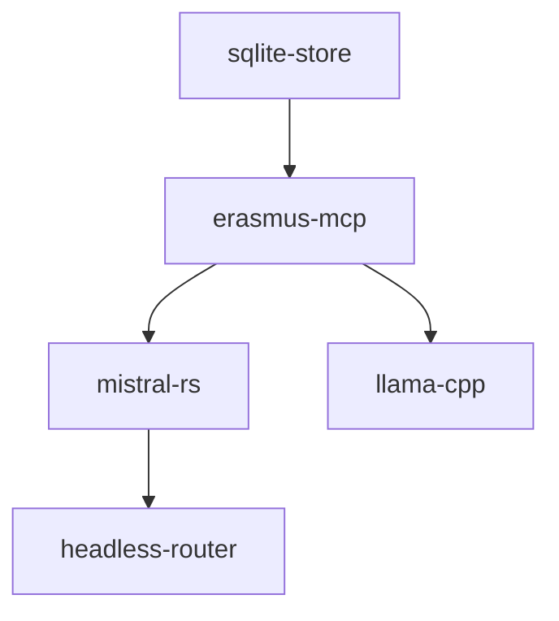
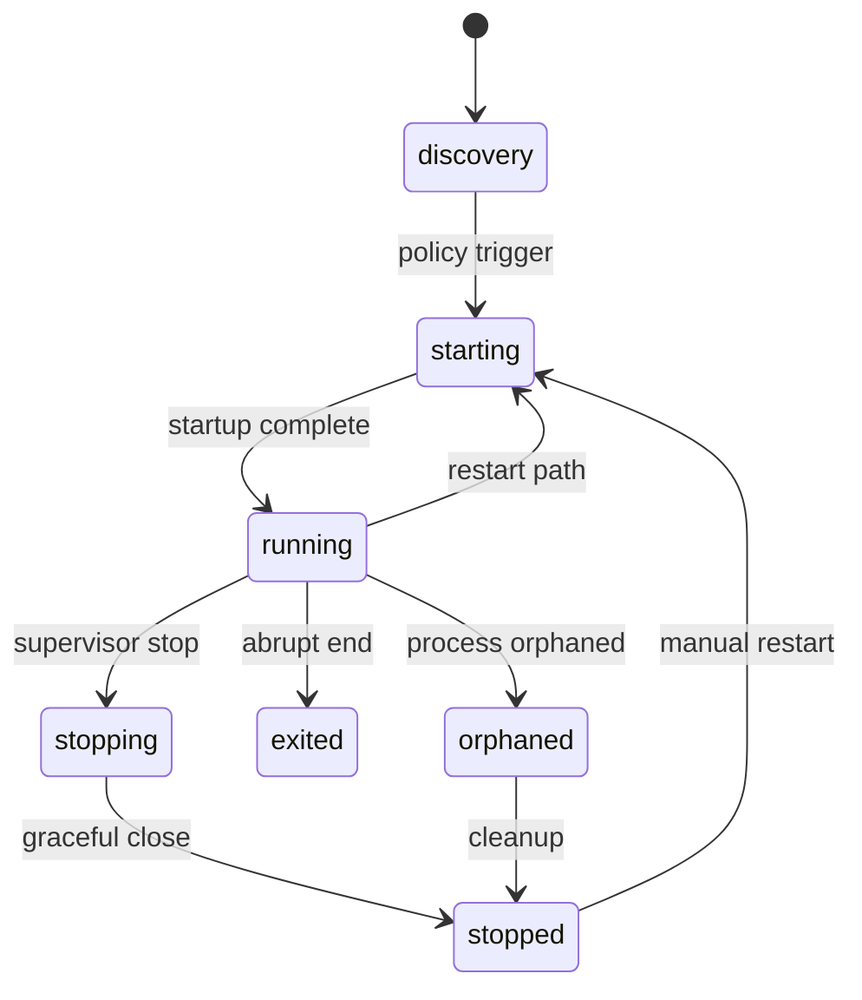

# Bootstrap Control-Plane Contracts

## Scope

This document defines versioned, deterministic contracts for bootstrap planning, discovery, health/readiness, supervision, recovery, and stop semantics. It is a governance-ready artifact for the existing vertical slice (Windows-first, local runtimes, one-process SQLite kernel).

## Contract bundle

All contracts live under:

- `contracts/bootstrap/component-spec.schema.json`
- `contracts/bootstrap/bootstrap-plan.schema.json`
- `contracts/bootstrap/service-observation.schema.json`
- `contracts/bootstrap/recovery-decision.schema.json`
- `contracts/bootstrap/bootstrap-result.schema.json`

Each schema is Draft-2020-12 and uses `additionalProperties: false` on authoritative object boundaries.

## Glossary

- **component specification**: A typed description of a process/configuration/executable/artifact and its required authorities.
- **bootstrap plan**: Ordered plan metadata including required/optional components, budgets, runtime policy, and evidence destination.
- **service observation**: One evidence-bearing health/readiness/recovery snapshot for a component instance.
- **recovery decision**: Typed recovery action policy with authority gating and retry/escalation bounds.
- **bootstrap result**: Immutable append-friendly output record for an execution attempt.
- **startup order**: Deterministic dependency ordering derived from component dependencies.
- **shutdown order**: Deterministic reverse of startup order.
- **owned process**: Component with explicit ownership proof for identity, executable, endpoint, and config digest.

## Field dictionary

### Component specification

| Field | Meaning |
| --- | --- |
| `component_id` | Stable component identity |
| `component_kind` | Minimal ontology (`managed_process`, `reusable_external_process`, `embedded_store`, `executable_dependency`, `configuration`, `artifact`) |
| `required` | Required component in bootstrap scope |
| `implementation_reference` | Exact tooling identity, version, and digest |
| `platform_constraints` | Allowed host OS constraints |
| `architecture_constraints` | Allowed CPU architecture constraints |
| `configuration_identity` | Declarative identity and digest of configuration |
| `dependencies` | Component-level declared dependency IDs |
| `startup_and_reuse_policy` | Startup mode + reuse + ownership fields |
| `health_policy` | Probe type and health-state requirements |
| `readiness_policy` | Ready-state semantics and timeout |
| `timeout_budget_ms` | Bounded startup/health/readiness/shutdown/force timings |
| `retry_budget` | Retry attempt and budget caps |
| `recovery_policy` | Recovery actions and authority constraints |
| `rollback` | Typed rollback behavior and evidence requirements |
| `evidence_requirements` | Mandatory evidence expectations |
| `secret_and_redaction` | Allowed redaction behavior and secret fields |
| `lifecycle_transitions` | Allowed lifecycle transitions with bounded durations |

### Plan

| Field | Meaning |
| --- | --- |
| `plan_id` / `plan_version` | Stable plan identity |
| `required_components` | Components required by the plan |
| `optional_components` | Components that may be used but are not required |
| `runtime_policy` | Runtime primary/fallback policy |
| `cumulative_budget_ms` | Bounded aggregate wall-clock budget |
| `retry_budget` | Global retry cap for the attempt |
| `dependency_graph` | Declared component-level dependencies |
| `degraded_mode` | Degradation policy and threshold |
| `rollback_order` | Deterministic reverse shutdown target |
| `stop_condition` | Success/degraded/blocked stop requirements |
| `evidence_destination` | JSONL/json append-only target and schema version |

### Service observation

| Field | Meaning |
| --- | --- |
| `component_id` | Target component identity |
| `observation_type` | `health` / `readiness` / `recovery` / `provenance` |
| `observation_time` | UTC ISO8601 timestamp |
| `lifecycle_state` | Independent lifecycle state |
| `result` | Independent health/readiness outcome |
| `provenance_identity` | Evidence-backed ownership classification |
| `dependency_states` | Bounded state snapshot for upstream dependencies |
| `freshness_until` | Evidence expiry boundary |

### Recovery decision

| Field | Meaning |
| --- | --- |
| `classification` | Recovery class |
| `observed_failure` | Failure code and evidence references |
| `required_authority` | Required authority for this decision |
| `permitted_actions` | Deterministic action set |
| `retry_count` | Current retry attempt count |
| `retry_budget_remaining` | Budget remaining |
| `resulting_expected_state` | Post-recovery state |
| `rollback_point` | Point to rollback if needed |

### Bootstrap result

| Field | Meaning |
| --- | --- |
| `run_id` / `plan_id` | Attempt and plan binding |
| `ordered_component_transitions` | Deterministic transition trace |
| `health_observations` | Health evidence references |
| `readiness_observations` | Readiness evidence references |
| `authorities` | Authorities exercised in this run |
| `timings_ms` | Bounded timing evidence |
| `final_expected_state` | End-state model for run outcome |

## Mermaid: deterministic dependency/startup relation



## Mermaid: lifecycle/health/readiness split



## Traceability to requirements (Section 2)

| Requirement (Addendum §2) | Contract field coverage |
| --- | --- |
| Discover project/runtime/dependencies | `plan.required_components`, `components.dependencies`, `plan.dependency_graph`, `service_observations` |
| Start required services in order | `plan.required_components`, topological ordering validator |
| Silent headless execution | `plan_id`, evidence references, `status` |
| Verify capabilities before ready | `health_policy`, `readiness_policy`, `service_observations` |
| Detect compatible reuse | `startup_and_reuse_policy`, `provenance_identity` |
| Recover stale/interrupted state | `recovery_policy`, `recovery_decisions`, `bootstrap_result` |
| Expose deterministic evidence | `evidence_destination`, `health_evidence`, `result_jsonl_version` |
| Mistral primary / llama fallback | `plan.runtime_policy` |
| Stop and shutdown policies | `shutdown_policy`, `plan.degraded_mode`, `shutdown_order` |
| Windows-first constraint | `installation_context.platform`, schema constraints |

## Windows verification commands

```powershell
python scripts\validate_bootstrap_contracts.py contracts\bootstrap\fixtures\valid-minimal-windows.json
python -m pytest tests\test_bootstrap_contracts.py -q
python -m pytest tests\ -q
```
